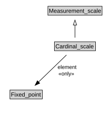

# Cardinal_scale

<a href="diagrams/Cardinal_scale.dot.svg">Open interactive Cardinal_scale diagram</a>

## Specializations of Cardinal_scale

| Class | Description |
|-------|-------------|
| [Cardinality_scale](Cardinality_scale.md) |  |

## Formalization for Cardinal_scale

| Property | Constraint |
|----------|------------|
| element | all Fixed_point |
| subClassOf | Measurement_scale |

