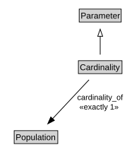

# Cardinality

<a href="diagrams/Cardinality.dot.svg">Open interactive Cardinality diagram</a>

## Formalization for Cardinality

| Property | Constraint |
|----------|------------|
| cardinality_of | exactly 1 owl:Thing |
| subClassOf | Parameter |

