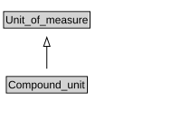

# Compound_unit

<a href="diagrams/Compound_unit.dot.svg">Open interactive Compound_unit diagram</a>

## Formalization for Compound_unit

| Property | Constraint |
|----------|------------|
| subClassOf | Unit_of_measure |

