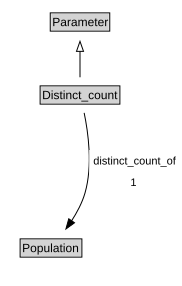

# Distinct_count

<a href="diagrams/Distinct_count.dot.svg">Open interactive Distinct_count diagram</a>

## Formalization for Distinct_count

| Property | Constraint |
|----------|------------|
| distinct_count_of | exactly 1 owl:Thing |
| subClassOf | Parameter |

