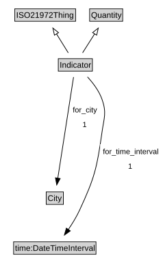

# Indicator

<a href="diagrams/Indicator.dot.svg">Open interactive Indicator diagram</a>

## Specializations of Indicator

| Class | Description |
|-------|-------------|
| [Difference Indicator](DifferenceIndicator.md) |  |
| [Ratio Indicator](RatioIndicator.md) |  |
| [Sum Indicator](SumIndicator.md) |  |

## Formalization for Indicator

| Property | Constraint |
|----------|------------|
| for_city | exactly 1 owl:Thing |
| for_time_interval | exactly 1 owl:Thing |
| subClassOf | ISO21972Thing |
| subClassOf | Quantity |

