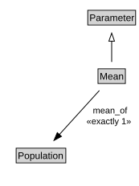

# Mean

<a href="diagrams/Mean.dot.svg">Open interactive Mean diagram</a>

## Formalization for Mean

| Property | Constraint |
|----------|------------|
| disjointWith | Standard_deviation |
| mean_of | exactly 1 owl:Thing |
| subClassOf | Parameter |

