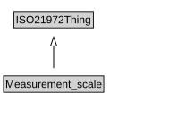

# Measurement_scale

<a href="diagrams/Measurement_scale.dot.svg">Open interactive Measurement_scale diagram</a>

## Specializations of Measurement_scale

| Class | Description |
|-------|-------------|
| [Cardinality_scale](Cardinality_scale.md) |  |

## Formalization for Measurement_scale

| Property | Constraint |
|----------|------------|
| subClassOf | ISO21972Thing |

## Other annotations

| Property | Value |
|----------|-------|
| om-1:alternative_label | scale |

