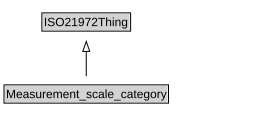

# Measurement_scale_category

<a href="diagrams/Measurement_scale_category.dot.svg">Open interactive Measurement_scale_category diagram</a>

## Formalization for Measurement_scale_category

| Property | Constraint |
|----------|------------|
| subClassOf | ISO21972Thing |

