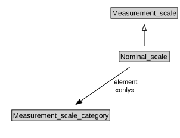

# Nominal_scale

<a href="diagrams/Nominal_scale.dot.svg">Open interactive Nominal_scale diagram</a>

## Formalization for Nominal_scale

| Property | Constraint |
|----------|------------|
| element | all Measurement_scale_category |
| subClassOf | Measurement_scale |

