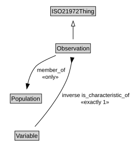

# Observation

<a href="diagrams/Observation.dot.svg">Open interactive Observation diagram</a>

## Formalization for Observation

| Property | Constraint |
|----------|------------|
| inverse is_characteristic_of | exactly 1 owl:Thing |
| member_of | all Population |
| subClassOf | ISO21972Thing |

## Used by classes

| Class | Property |
|-------|----------|
| [Sample](Sample.md) | is_composed_of |
| [Variable](Variable.md) | is_characteristic_of |

