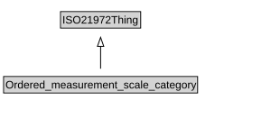

# Ordered_measurement_scale_category

<a href="diagrams/Ordered_measurement_scale_category.dot.svg">Open interactive Ordered_measurement_scale_category diagram</a>

## Formalization for Ordered_measurement_scale_category

| Property | Constraint |
|----------|------------|
| subClassOf | ISO21972Thing |

