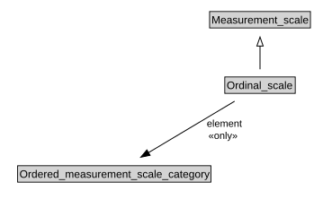

# Ordinal_scale

<a href="diagrams/Ordinal_scale.dot.svg">Open interactive Ordinal_scale diagram</a>

## Formalization for Ordinal_scale

| Property | Constraint |
|----------|------------|
| element | all Ordered_measurement_scale_category |
| subClassOf | Measurement_scale |

