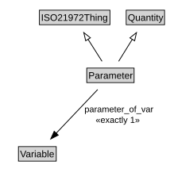

# Parameter

<a href="diagrams/Parameter.dot.svg">Open interactive Parameter diagram</a>

## Specializations of Parameter

| Class | Description |
|-------|-------------|
| [Cardinality](Cardinality.md) |  |
| [Distinct_count](Distinct_count.md) |  |
| [Mean](Mean.md) |  |
| [Standard_deviation](Standard_deviation.md) |  |
| [Sum](Sum.md) |  |

## Formalization for Parameter

| Property | Constraint |
|----------|------------|
| parameter_of_var | exactly 1 owl:Thing |
| subClassOf | ISO21972Thing |
| subClassOf | Quantity |

## Used by classes

| Class | Property |
|-------|----------|
| [Population](Population.md) | is_described_by |
| [Statistic](Statistic.md) | is_an_estimate_of |

