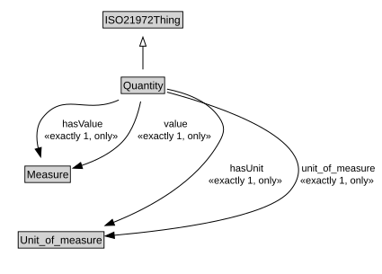

# Quantity

<a href="diagrams/Quantity.dot.svg">Open interactive Quantity diagram</a>

## Specializations of Quantity

| Class | Description |
|-------|-------------|
| [Cardinality](Cardinality.md) |  |
| [Difference Indicator](DifferenceIndicator.md) |  |
| [Distinct_count](Distinct_count.md) |  |
| [Indicator](Indicator.md) |  |
| [Mean](Mean.md) |  |
| [Parameter](Parameter.md) |  |
| [Ratio Indicator](RatioIndicator.md) |  |
| [Standard_deviation](Standard_deviation.md) |  |
| [Sum](Sum.md) |  |
| [Sum Indicator](SumIndicator.md) |  |

## Formalization for Quantity

| Property | Constraint |
|----------|------------|
| hasUnit | all Unit_of_measure |
| hasUnit | exactly 1 owl:Thing |
| hasValue | all Measure |
| hasValue | exactly 1 owl:Thing |
| subClassOf | ISO21972Thing |
| unit_of_measure | all Unit_of_measure |
| unit_of_measure | exactly 1 owl:Thing |
| value | all Measure |
| value | exactly 1 owl:Thing |

