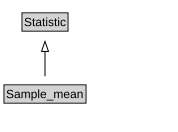

# Sample_mean

<a href="diagrams/Sample_mean.dot.svg">Open interactive Sample_mean diagram</a>

## Formalization for Sample_mean

| Property | Constraint |
|----------|------------|
| disjointWith | Sample_standard_deviation |
| subClassOf | Statistic |

