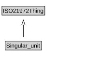

# Singular_unit

<a href="diagrams/Singular_unit.dot.svg">Open interactive Singular_unit diagram</a>

## Specializations of Singular_unit

| Class | Description |
|-------|-------------|
| [Cardinality_unit](Cardinality_unit.md) |  |
| [Monetary_unit](Monetary_unit.md) |  |

## Formalization for Singular_unit

| Property | Constraint |
|----------|------------|
| subClassOf | ISO21972Thing |

