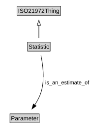

# Statistic

<a href="diagrams/Statistic.dot.svg">Open interactive Statistic diagram</a>

## Specializations of Statistic

| Class | Description |
|-------|-------------|
| [Sample_cardinality](Sample_cardinality.md) |  |
| [Sample_mean](Sample_mean.md) |  |
| [Sample_standard_deviation](Sample_standard_deviation.md) |  |
| [Sample_sum](Sample_sum.md) |  |

## Formalization for Statistic

| Property | Constraint |
|----------|------------|
| is_an_estimate_of | all Parameter |
| subClassOf | ISO21972Thing |

## Used by classes

| Class | Property |
|-------|----------|
| [Sample](Sample.md) | is_described_by |

