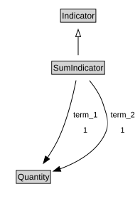

# SumIndicator

<a href="diagrams/SumIndicator.dot.svg">Open interactive SumIndicator diagram</a>

## Formalization for SumIndicator

| Property | Constraint |
|----------|------------|
| subClassOf | Indicator |
| term_1 | exactly 1 owl:Thing |
| term_2 | exactly 1 owl:Thing |

