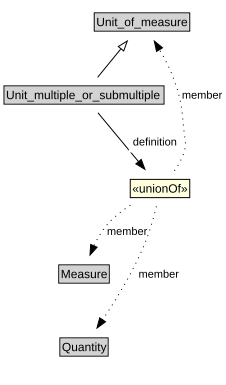

# Unit_multiple_or_submultiple

<a href="diagrams/Unit_multiple_or_submultiple.dot.svg">Open interactive Unit_multiple_or_submultiple diagram</a>

## Formalization for Unit_multiple_or_submultiple

| Property | Constraint |
|----------|------------|
| definition | all Measure or Quantity or Unit_of_measure |
| subClassOf | Unit_of_measure |

