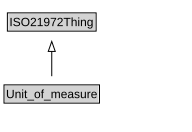

# Unit_of_measure

<a href="diagrams/Unit_of_measure.dot.svg">Open interactive Unit_of_measure diagram</a>

## Formalization for Unit_of_measure

| Property | Constraint |
|----------|------------|
| subClassOf | ISO21972Thing |

## Other annotations

| Property | Value |
|----------|-------|
| om-1:alternative_label | unit |
| om-1:alternative_label | unit of measurement |

