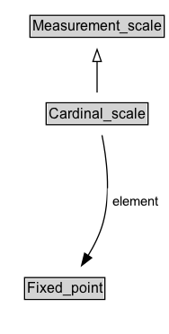

# Cardinal_scale

## Diagram

=== "SVG (interactive)"

    <!-- Generated by graphviz version 14.1.3 (20260303.0454)
     -->
    <!-- Pages: 1 -->
    <svg width="141pt" height="279pt"
     viewBox="0.00 0.00 141.00 279.00" xmlns="http://www.w3.org/2000/svg" xmlns:xlink="http://www.w3.org/1999/xlink">
    <g id="graph0" class="graph" transform="scale(1 1) rotate(0) translate(4 275)">
    <polygon fill="white" stroke="none" points="-4,4 -4,-275 137,-275 137,4 -4,4"/>
    <g id="clust3" class="cluster">
    <title>cluster_associated</title>
    </g>
    <!-- Measurement_scale -->
    <g id="node1" class="node">
    <title>Measurement_scale</title>
    <g id="a_node1"><a xlink:href="../Measurement_scale" xlink:title="&lt;TABLE&gt;">
    <polygon fill="lightgray" stroke="none" points="22,-244.88 22,-261.12 132,-261.12 132,-244.88 22,-244.88"/>
    <text xml:space="preserve" text-anchor="start" x="23" y="-248.88" font-family="Arial" font-size="12.00">Measurement_scale</text>
    <polygon fill="none" stroke="black" points="21,-243.88 21,-262.12 133,-262.12 133,-243.88 21,-243.88"/>
    </a>
    </g>
    </g>
    <!-- Cardinal_scale -->
    <g id="node2" class="node">
    <title>Cardinal_scale</title>
    <g id="a_node2"><a xlink:href="../Cardinal_scale" xlink:title="&lt;TABLE&gt;">
    <polygon fill="lightgray" stroke="none" points="35.5,-171.88 35.5,-188.12 118.5,-188.12 118.5,-171.88 35.5,-171.88"/>
    <text xml:space="preserve" text-anchor="start" x="36.5" y="-175.88" font-family="Arial" font-size="12.00">Cardinal_scale</text>
    <polygon fill="none" stroke="black" points="34.5,-170.88 34.5,-189.12 119.5,-189.12 119.5,-170.88 34.5,-170.88"/>
    </a>
    </g>
    </g>
    <!-- Cardinal_scale&#45;&gt;Measurement_scale -->
    <g id="edge1" class="edge">
    <title>Cardinal_scale&#45;&gt;Measurement_scale</title>
    <path fill="none" stroke="black" d="M77,-197.71C77,-205.47 77,-214.92 77,-223.74"/>
    <polygon fill="none" stroke="black" points="73.5,-223.66 77,-233.66 80.5,-223.66 73.5,-223.66"/>
    </g>
    <!-- Invis -->
    <!-- Cardinal_scale&#45;&gt;Invis -->
    <!-- Fixed_point -->
    <g id="node4" class="node">
    <title>Fixed_point</title>
    <g id="a_node4"><a xlink:href="../Fixed_point" xlink:title="&lt;TABLE&gt;">
    <polygon fill="lightgray" stroke="none" points="17.5,-25.88 17.5,-42.12 82.5,-42.12 82.5,-25.88 17.5,-25.88"/>
    <text xml:space="preserve" text-anchor="start" x="18.5" y="-29.88" font-family="Arial" font-size="12.00">Fixed_point</text>
    <polygon fill="none" stroke="black" points="16.5,-24.88 16.5,-43.12 83.5,-43.12 83.5,-24.88 16.5,-24.88"/>
    </a>
    </g>
    </g>
    <!-- Cardinal_scale&#45;&gt;Fixed_point -->
    <g id="edge4" class="edge">
    <title>Cardinal_scale&#45;&gt;Fixed_point</title>
    <path fill="none" stroke="black" d="M81.1,-162.07C84.82,-143.73 88.78,-113.75 82,-89 79.38,-79.44 74.58,-69.85 69.48,-61.46"/>
    <polygon fill="black" stroke="black" points="72.46,-59.63 64.06,-53.18 66.6,-63.46 72.46,-59.63"/>
    <polygon fill="white" stroke="none" points="85.69,-96.25 85.69,-117.75 131.94,-117.75 131.94,-96.25 85.69,-96.25"/>
    <text xml:space="preserve" text-anchor="start" x="89.69" y="-103.25" font-family="Arial" font-size="11.00">element</text>
    </g>
    <!-- Invis&#45;&gt;Fixed_point -->
    </g>
    </svg>

=== "PNG"

    

## Specializations of Cardinal_scale

| Class | Description |
|-------|-------------|
| [Cardinality_scale](Cardinality_scale.md) |  |
| [Interval Scale](Interval_scale.md) |  |
| [Ratio Scale](Ratio_scale.md) |  |

## Formalization for Cardinal_scale

| Property | Constraint |
|----------|------------|
| [element](../properties/element.md) | only [Fixed_point](https://w3id.org/citydata/21972/v1/Fixed_point) |
| subClassOf | [Measurement_scale](Measurement_scale.md) |

