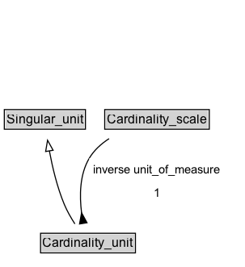

# Cardinality_unit

## Diagram

=== "SVG (interactive)"

    <!-- Generated by graphviz version 14.1.3 (20260303.0454)
     -->
    <!-- Pages: 1 -->
    <svg width="228pt" height="248pt"
     viewBox="0.00 0.00 228.00 248.00" xmlns="http://www.w3.org/2000/svg" xmlns:xlink="http://www.w3.org/1999/xlink">
    <g id="graph0" class="graph" transform="scale(1 1) rotate(0) translate(4 244)">
    <polygon fill="white" stroke="none" points="-4,4 -4,-244 223.5,-244 223.5,4 -4,4"/>
    <g id="clust3" class="cluster">
    <title>cluster_associated</title>
    </g>
    <!-- Singular_unit -->
    <g id="node1" class="node">
    <title>Singular_unit</title>
    <g id="a_node1"><a xlink:href="../Singular_unit" xlink:title="&lt;TABLE&gt;">
    <polygon fill="lightgray" stroke="none" points="1,-124.88 1,-141.12 74.25,-141.12 74.25,-124.88 1,-124.88"/>
    <text xml:space="preserve" text-anchor="start" x="2" y="-128.88" font-family="Arial" font-size="12.00">Singular_unit</text>
    <polygon fill="none" stroke="black" points="0,-123.88 0,-142.12 75.25,-142.12 75.25,-123.88 0,-123.88"/>
    </a>
    </g>
    </g>
    <!-- Cardinality_unit -->
    <g id="node2" class="node">
    <title>Cardinality_unit</title>
    <g id="a_node2"><a xlink:href="../Cardinality_unit" xlink:title="&lt;TABLE&gt;">
    <polygon fill="lightgray" stroke="none" points="34.62,-9.88 34.62,-26.12 120.62,-26.12 120.62,-9.88 34.62,-9.88"/>
    <text xml:space="preserve" text-anchor="start" x="35.62" y="-13.88" font-family="Arial" font-size="12.00">Cardinality_unit</text>
    <polygon fill="none" stroke="black" points="33.62,-8.88 33.62,-27.12 121.62,-27.12 121.62,-8.88 33.62,-8.88"/>
    </a>
    </g>
    </g>
    <!-- Cardinality_unit&#45;&gt;Singular_unit -->
    <g id="edge1" class="edge">
    <title>Cardinality_unit&#45;&gt;Singular_unit</title>
    <path fill="none" stroke="black" d="M65.46,-35.82C61.87,-41.4 58.21,-47.77 55.62,-54 49.02,-69.9 44.59,-88.67 41.78,-103.82"/>
    <polygon fill="none" stroke="black" points="38.35,-103.13 40.12,-113.57 45.25,-104.31 38.35,-103.13"/>
    </g>
    <!-- Invis -->
    <!-- Cardinality_unit&#45;&gt;Invis -->
    <!-- Cardinality_scale -->
    <g id="node4" class="node">
    <title>Cardinality_scale</title>
    <g id="a_node4"><a xlink:href="../Cardinality_scale" xlink:title="&lt;TABLE&gt;">
    <polygon fill="lightgray" stroke="none" points="94.12,-124.88 94.12,-141.12 189.12,-141.12 189.12,-124.88 94.12,-124.88"/>
    <text xml:space="preserve" text-anchor="start" x="95.12" y="-128.88" font-family="Arial" font-size="12.00">Cardinality_scale</text>
    <polygon fill="none" stroke="black" points="93.12,-123.88 93.12,-142.12 190.12,-142.12 190.12,-123.88 93.12,-123.88"/>
    </a>
    </g>
    </g>
    <!-- Invis&#45;&gt;Cardinality_scale -->
    <!-- Cardinality_scale&#45;&gt;Cardinality_unit -->
    <g id="edge4" class="edge">
    <title>Cardinality_scale&#45;&gt;Cardinality_unit</title>
    <path fill="none" stroke="black" d="M97.17,-115.08C89.89,-110.33 83.29,-104.39 78.88,-97 69.84,-81.89 69.66,-62.01 71.67,-46.1"/>
    <polygon fill="black" stroke="black" points="76.7,-36.89 71.65,-46.2 69.79,-35.77 76.7,-36.89"/>
    <polygon fill="white" stroke="none" points="78.88,-54 78.88,-97 204.62,-97 204.62,-54 78.88,-54"/>
    <text xml:space="preserve" text-anchor="start" x="82.88" y="-82.5" font-family="Arial" font-size="11.00">inverse unit_of_measure</text>
    <text xml:space="preserve" text-anchor="start" x="138.75" y="-61" font-family="Arial" font-size="11.00">1</text>
    </g>
    </g>
    </svg>

=== "PNG"

    

## Formalization for Cardinality_unit

| Property | Constraint |
|----------|------------|
| inverse [unit_of_measure](../properties/unit_of_measure.md) | exactly 1 |
| subClassOf | [Singular_unit](Singular_unit.md) |

