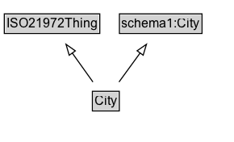

# City

**IRI**: `https://w3id.org/citydata/21972/v1/City`

## Diagram

=== "SVG (interactive)"

    <!-- Generated by graphviz version 14.1.3 (20260303.0454)
     -->
    <!-- Pages: 1 -->
    <svg width="217pt" height="132pt"
     viewBox="0.00 0.00 217.00 132.00" xmlns="http://www.w3.org/2000/svg" xmlns:xlink="http://www.w3.org/1999/xlink">
    <g id="graph0" class="graph" transform="scale(1 1) rotate(0) translate(4 128)">
    <polygon fill="white" stroke="none" points="-4,4 -4,-128 213.38,-128 213.38,4 -4,4"/>
    <g id="clust3" class="cluster">
    <title>cluster_associated</title>
    </g>
    <!-- ISO21972Thing -->
    <g id="node1" class="node">
    <title>ISO21972Thing</title>
    <g id="a_node1"><a xlink:href="../ISO21972Thing" xlink:title="&lt;TABLE&gt;">
    <polygon fill="lightgray" stroke="none" points="1,-97.88 1,-114.12 87.75,-114.12 87.75,-97.88 1,-97.88"/>
    <text xml:space="preserve" text-anchor="start" x="2" y="-101.88" font-family="Arial" font-size="12.00">ISO21972Thing</text>
    <polygon fill="none" stroke="black" points="0,-96.88 0,-115.12 88.75,-115.12 88.75,-96.88 0,-96.88"/>
    </a>
    </g>
    </g>
    <!-- schema1_City -->
    <g id="node2" class="node">
    <title>schema1_City</title>
    <g id="a_node2"><a xlink:href="https://w3id.org/citydata/imported/schema1/latest/City" xlink:title="&lt;TABLE&gt;">
    <polygon fill="lightgray" stroke="none" points="108,-97.88 108,-114.12 182.75,-114.12 182.75,-97.88 108,-97.88"/>
    <text xml:space="preserve" text-anchor="start" x="109" y="-101.88" font-family="Arial" font-size="12.00">schema1:City</text>
    <polygon fill="none" stroke="black" points="107,-96.88 107,-115.12 183.75,-115.12 183.75,-96.88 107,-96.88"/>
    </a>
    </g>
    </g>
    <!-- City -->
    <g id="node3" class="node">
    <title>City</title>
    <g id="a_node3"><a xlink:href="../City" xlink:title="&lt;TABLE&gt;">
    <polygon fill="lightgray" stroke="none" points="82.88,-25.88 82.88,-42.12 105.88,-42.12 105.88,-25.88 82.88,-25.88"/>
    <text xml:space="preserve" text-anchor="start" x="83.88" y="-29.88" font-family="Arial" font-size="12.00">City</text>
    <polygon fill="none" stroke="black" points="81.88,-24.88 81.88,-43.12 106.88,-43.12 106.88,-24.88 81.88,-24.88"/>
    </a>
    </g>
    </g>
    <!-- City&#45;&gt;ISO21972Thing -->
    <g id="edge1" class="edge">
    <title>City&#45;&gt;ISO21972Thing</title>
    <path fill="none" stroke="black" d="M82.38,-51.79C76.63,-59.85 69.59,-69.69 63.15,-78.71"/>
    <polygon fill="none" stroke="black" points="60.32,-76.65 57.36,-86.82 66.02,-80.72 60.32,-76.65"/>
    </g>
    <!-- City&#45;&gt;schema1_City -->
    <g id="edge2" class="edge">
    <title>City&#45;&gt;schema1_City</title>
    <path fill="none" stroke="black" d="M106.61,-51.79C112.54,-59.93 119.8,-69.9 126.43,-79"/>
    <polygon fill="none" stroke="black" points="123.42,-80.81 132.14,-86.83 129.08,-76.69 123.42,-80.81"/>
    </g>
    <!-- Invis -->
    </g>
    </svg>

=== "PNG"

    

## Formalization for City

| Property | Constraint |
|----------|------------|
| subClassOf | [schema1:City](https://w3id.org/citydata/imported/schema1/City) |
| subClassOf | [ISO21972Thing](ISO21972Thing.md) |

