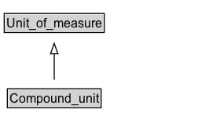

# Compound_unit

**IRI**: `https://w3id.org/citydata/21972/v1/Compound_unit`

## Diagram

=== "SVG (interactive)"

    <!-- Generated by graphviz version 14.1.3 (20260303.0454)
     -->
    <!-- Pages: 1 -->
    <svg width="189pt" height="132pt"
     viewBox="0.00 0.00 189.00 132.00" xmlns="http://www.w3.org/2000/svg" xmlns:xlink="http://www.w3.org/1999/xlink">
    <g id="graph0" class="graph" transform="scale(1 1) rotate(0) translate(4 128)">
    <polygon fill="white" stroke="none" points="-4,4 -4,-128 184.75,-128 184.75,4 -4,4"/>
    <g id="clust3" class="cluster">
    <title>cluster_associated</title>
    </g>
    <!-- Unit_of_measure -->
    <g id="node1" class="node">
    <title>Unit_of_measure</title>
    <g id="a_node1"><a xlink:href="../Unit_of_measure" xlink:title="&lt;TABLE&gt;">
    <polygon fill="lightgray" stroke="none" points="1,-97.88 1,-114.12 94.5,-114.12 94.5,-97.88 1,-97.88"/>
    <text xml:space="preserve" text-anchor="start" x="2" y="-101.88" font-family="Arial" font-size="12.00">Unit_of_measure</text>
    <polygon fill="none" stroke="black" points="0,-96.88 0,-115.12 95.5,-115.12 95.5,-96.88 0,-96.88"/>
    </a>
    </g>
    </g>
    <!-- Compound_unit -->
    <g id="node2" class="node">
    <title>Compound_unit</title>
    <g id="a_node2"><a xlink:href="../Compound_unit" xlink:title="&lt;TABLE&gt;">
    <polygon fill="lightgray" stroke="none" points="4,-25.88 4,-42.12 91.5,-42.12 91.5,-25.88 4,-25.88"/>
    <text xml:space="preserve" text-anchor="start" x="5" y="-29.88" font-family="Arial" font-size="12.00">Compound_unit</text>
    <polygon fill="none" stroke="black" points="3,-24.88 3,-43.12 92.5,-43.12 92.5,-24.88 3,-24.88"/>
    </a>
    </g>
    </g>
    <!-- Compound_unit&#45;&gt;Unit_of_measure -->
    <g id="edge1" class="edge">
    <title>Compound_unit&#45;&gt;Unit_of_measure</title>
    <path fill="none" stroke="black" d="M47.75,-51.79C47.75,-59.25 47.75,-68.24 47.75,-76.69"/>
    <polygon fill="none" stroke="black" points="44.25,-76.54 47.75,-86.54 51.25,-76.54 44.25,-76.54"/>
    </g>
    <!-- Invis -->
    </g>
    </svg>

=== "PNG"

    

## Specializations of Compound_unit

| Class | Description |
|-------|-------------|
| [Unit Division](Unit_division.md) |  |
| [Unit Exponentiation](Unit_exponentiation.md) |  |
| [Unit Multiplication](Unit_multiplication.md) |  |

## Formalization for Compound_unit

| Property | Constraint |
|----------|------------|
| subClassOf | [Unit_of_measure](Unit_of_measure.md) |

