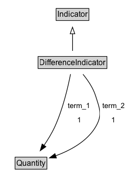

# DifferenceIndicator

Difference between term_1 and term_2 (term_1 - term_2)

## Diagram

=== "SVG (interactive)"

    <!-- Generated by graphviz version 14.1.3 (20260303.0454)
     -->
    <!-- Pages: 1 -->
    <svg width="197pt" height="286pt"
     viewBox="0.00 0.00 197.00 286.00" xmlns="http://www.w3.org/2000/svg" xmlns:xlink="http://www.w3.org/1999/xlink">
    <g id="graph0" class="graph" transform="scale(1 1) rotate(0) translate(4 282)">
    <polygon fill="white" stroke="none" points="-4,4 -4,-282 193.27,-282 193.27,4 -4,4"/>
    <g id="clust3" class="cluster">
    <title>cluster_associated</title>
    </g>
    <!-- Indicator -->
    <g id="node1" class="node">
    <title>Indicator</title>
    <g id="a_node1"><a xlink:href="../Indicator" xlink:title="&lt;TABLE&gt;">
    <polygon fill="lightgray" stroke="none" points="82.12,-251.88 82.12,-268.12 129.88,-268.12 129.88,-251.88 82.12,-251.88"/>
    <text xml:space="preserve" text-anchor="start" x="83.12" y="-255.88" font-family="Arial" font-size="12.00">Indicator</text>
    <polygon fill="none" stroke="black" points="81.12,-250.88 81.12,-269.12 130.88,-269.12 130.88,-250.88 81.12,-250.88"/>
    </a>
    </g>
    </g>
    <!-- DifferenceIndicator -->
    <g id="node2" class="node">
    <title>DifferenceIndicator</title>
    <g id="a_node2"><a xlink:href="../DifferenceIndicator" xlink:title="&lt;TABLE&gt;">
    <polygon fill="lightgray" stroke="none" points="54.75,-178.88 54.75,-195.12 157.25,-195.12 157.25,-178.88 54.75,-178.88"/>
    <text xml:space="preserve" text-anchor="start" x="55.75" y="-182.88" font-family="Arial" font-size="12.00">DifferenceIndicator</text>
    <polygon fill="none" stroke="black" points="53.75,-177.88 53.75,-196.12 158.25,-196.12 158.25,-177.88 53.75,-177.88"/>
    </a>
    </g>
    </g>
    <!-- DifferenceIndicator&#45;&gt;Indicator -->
    <g id="edge1" class="edge">
    <title>DifferenceIndicator&#45;&gt;Indicator</title>
    <path fill="none" stroke="black" d="M106,-204.71C106,-212.47 106,-221.92 106,-230.74"/>
    <polygon fill="none" stroke="black" points="102.5,-230.66 106,-240.66 109.5,-230.66 102.5,-230.66"/>
    </g>
    <!-- Invis -->
    <!-- DifferenceIndicator&#45;&gt;Invis -->
    <!-- Quantity -->
    <g id="node4" class="node">
    <title>Quantity</title>
    <g id="a_node4"><a xlink:href="../Quantity" xlink:title="&lt;TABLE&gt;">
    <polygon fill="lightgray" stroke="none" points="19.88,-25.88 19.88,-42.12 66.12,-42.12 66.12,-25.88 19.88,-25.88"/>
    <text xml:space="preserve" text-anchor="start" x="20.88" y="-29.88" font-family="Arial" font-size="12.00">Quantity</text>
    <polygon fill="none" stroke="black" points="18.88,-24.88 18.88,-43.12 67.12,-43.12 67.12,-24.88 18.88,-24.88"/>
    </a>
    </g>
    </g>
    <!-- DifferenceIndicator&#45;&gt;Quantity -->
    <g id="edge4" class="edge">
    <title>DifferenceIndicator&#45;&gt;Quantity</title>
    <path fill="none" stroke="black" d="M103.03,-169.31C99.13,-149.53 91.31,-115.86 79,-89 74.57,-79.33 68.5,-69.44 62.62,-60.81"/>
    <polygon fill="black" stroke="black" points="65.66,-59.05 57.02,-52.92 59.95,-63.11 65.66,-59.05"/>
    <polygon fill="white" stroke="none" points="95.07,-89 95.07,-132 136.82,-132 136.82,-89 95.07,-89"/>
    <text xml:space="preserve" text-anchor="start" x="99.07" y="-117.5" font-family="Arial" font-size="11.00">term_1</text>
    <text xml:space="preserve" text-anchor="start" x="112.95" y="-96" font-family="Arial" font-size="11.00">1</text>
    </g>
    <!-- DifferenceIndicator&#45;&gt;Quantity -->
    <g id="edge5" class="edge">
    <title>DifferenceIndicator&#45;&gt;Quantity</title>
    <path fill="none" stroke="black" d="M121.9,-169.12C129.24,-160.17 137.17,-148.54 141,-136.5 147.39,-116.38 151.74,-107.18 141,-89 127.9,-66.82 102.08,-53.13 80.23,-45.09"/>
    <polygon fill="black" stroke="black" points="81.6,-41.86 71.01,-41.96 79.36,-48.49 81.6,-41.86"/>
    <polygon fill="white" stroke="none" points="147.52,-89 147.52,-132 189.27,-132 189.27,-89 147.52,-89"/>
    <text xml:space="preserve" text-anchor="start" x="151.52" y="-117.5" font-family="Arial" font-size="11.00">term_2</text>
    <text xml:space="preserve" text-anchor="start" x="165.4" y="-96" font-family="Arial" font-size="11.00">1</text>
    </g>
    <!-- Invis&#45;&gt;Quantity -->
    </g>
    </svg>

=== "PNG"

    

## Formalization for DifferenceIndicator

| Property | Constraint |
|----------|------------|
| [term_1](../properties/term_1.md) | exactly 1 |
| [term_1](../properties/term_1.md) | exactly 1 [Quantity](https://w3id.org/citydata/21972/v1/Quantity) |
| [term_2](../properties/term_2.md) | exactly 1 |
| [term_2](../properties/term_2.md) | exactly 1 [Quantity](https://w3id.org/citydata/21972/v1/Quantity) |
| subClassOf | [Indicator](Indicator.md) |

