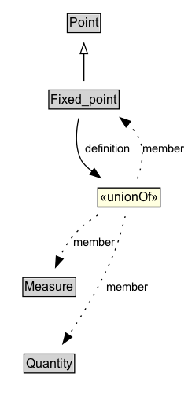

# Fixed_point

## Diagram

=== "SVG (interactive)"

    <!-- Generated by graphviz version 14.1.3 (20260303.0454)
     -->
    <!-- Pages: 1 -->
    <svg width="179pt" height="385pt"
     viewBox="0.00 0.00 179.00 385.00" xmlns="http://www.w3.org/2000/svg" xmlns:xlink="http://www.w3.org/1999/xlink">
    <g id="graph0" class="graph" transform="scale(1 1) rotate(0) translate(4 381)">
    <polygon fill="white" stroke="none" points="-4,4 -4,-381 175.43,-381 175.43,4 -4,4"/>
    <g id="clust3" class="cluster">
    <title>cluster_associated</title>
    </g>
    <!-- Point -->
    <g id="node1" class="node">
    <title>Point</title>
    <g id="a_node1"><a xlink:href="../Point" xlink:title="&lt;TABLE&gt;">
    <polygon fill="lightgray" stroke="none" points="61.12,-350.88 61.12,-367.12 90.88,-367.12 90.88,-350.88 61.12,-350.88"/>
    <text xml:space="preserve" text-anchor="start" x="62.12" y="-354.88" font-family="Arial" font-size="12.00">Point</text>
    <polygon fill="none" stroke="black" points="60.12,-349.88 60.12,-368.12 91.88,-368.12 91.88,-349.88 60.12,-349.88"/>
    </a>
    </g>
    </g>
    <!-- Fixed_point -->
    <g id="node2" class="node">
    <title>Fixed_point</title>
    <g id="a_node2"><a xlink:href="../Fixed_point" xlink:title="&lt;TABLE&gt;">
    <polygon fill="lightgray" stroke="none" points="43.5,-277.88 43.5,-294.12 108.5,-294.12 108.5,-277.88 43.5,-277.88"/>
    <text xml:space="preserve" text-anchor="start" x="44.5" y="-281.88" font-family="Arial" font-size="12.00">Fixed_point</text>
    <polygon fill="none" stroke="black" points="42.5,-276.88 42.5,-295.12 109.5,-295.12 109.5,-276.88 42.5,-276.88"/>
    </a>
    </g>
    </g>
    <!-- Fixed_point&#45;&gt;Point -->
    <g id="edge1" class="edge">
    <title>Fixed_point&#45;&gt;Point</title>
    <path fill="none" stroke="black" d="M76,-303.71C76,-311.47 76,-320.92 76,-329.74"/>
    <polygon fill="none" stroke="black" points="72.5,-329.66 76,-339.66 79.5,-329.66 72.5,-329.66"/>
    </g>
    <!-- Invis -->
    <!-- Fixed_point&#45;&gt;Invis -->
    <!-- n49e7333729f74c3eb91b9b7c78626a1eb10 -->
    <g id="node6" class="node">
    <title>n49e7333729f74c3eb91b9b7c78626a1eb10</title>
    <polygon fill="lightyellow" stroke="none" points="89.25,-183.38 89.25,-201.62 148.75,-201.62 148.75,-183.38 89.25,-183.38"/>
    <text xml:space="preserve" text-anchor="start" x="91.25" y="-188.38" font-family="Arial" font-size="12.00">«unionOf»</text>
    <polygon fill="none" stroke="black" points="89.25,-183.38 89.25,-201.62 148.75,-201.62 148.75,-183.38 89.25,-183.38"/>
    </g>
    <!-- Fixed_point&#45;&gt;n49e7333729f74c3eb91b9b7c78626a1eb10 -->
    <g id="edge8" class="edge">
    <title>Fixed_point&#45;&gt;n49e7333729f74c3eb91b9b7c78626a1eb10</title>
    <path fill="none" stroke="black" d="M71.01,-268.05C68.53,-256.34 67.2,-240.74 73.25,-228.5 74.81,-225.35 78.95,-221.3 84.15,-217.07"/>
    <polygon fill="black" stroke="black" points="85.89,-220.14 91.75,-211.31 81.66,-214.56 85.89,-220.14"/>
    <polygon fill="white" stroke="none" points="73.25,-228.5 73.25,-250 124,-250 124,-228.5 73.25,-228.5"/>
    <text xml:space="preserve" text-anchor="start" x="77.25" y="-235.5" font-family="Arial" font-size="11.00">definition</text>
    </g>
    <!-- Measure -->
    <g id="node4" class="node">
    <title>Measure</title>
    <g id="a_node4"><a xlink:href="../Measure" xlink:title="&lt;TABLE&gt;">
    <polygon fill="lightgray" stroke="none" points="18.75,-98.88 18.75,-115.12 67.25,-115.12 67.25,-98.88 18.75,-98.88"/>
    <text xml:space="preserve" text-anchor="start" x="19.75" y="-102.88" font-family="Arial" font-size="12.00">Measure</text>
    <polygon fill="none" stroke="black" points="17.75,-97.88 17.75,-116.12 68.25,-116.12 68.25,-97.88 17.75,-97.88"/>
    </a>
    </g>
    </g>
    <!-- Invis&#45;&gt;Measure -->
    <!-- Quantity -->
    <g id="node5" class="node">
    <title>Quantity</title>
    <g id="a_node5"><a xlink:href="../Quantity" xlink:title="&lt;TABLE&gt;">
    <polygon fill="lightgray" stroke="none" points="19.88,-25.88 19.88,-42.12 66.12,-42.12 66.12,-25.88 19.88,-25.88"/>
    <text xml:space="preserve" text-anchor="start" x="20.88" y="-29.88" font-family="Arial" font-size="12.00">Quantity</text>
    <polygon fill="none" stroke="black" points="18.88,-24.88 18.88,-43.12 67.12,-43.12 67.12,-24.88 18.88,-24.88"/>
    </a>
    </g>
    </g>
    <!-- Measure&#45;&gt;Quantity -->
    <!-- n49e7333729f74c3eb91b9b7c78626a1eb10&#45;&gt;Fixed_point -->
    <g id="edge5" class="edge">
    <title>n49e7333729f74c3eb91b9b7c78626a1eb10&#45;&gt;Fixed_point</title>
    <path fill="none" stroke="black" stroke-dasharray="1,5" d="M126.99,-210.48C131.28,-222.2 134.49,-237.81 128,-250 125.48,-254.73 122,-258.94 118.03,-262.65"/>
    <polygon fill="black" stroke="black" points="116.16,-259.67 110.52,-268.63 120.52,-265.14 116.16,-259.67"/>
    <text xml:space="preserve" text-anchor="middle" x="151.56" y="-235.55" font-family="Arial" font-size="11.00">member</text>
    </g>
    <!-- n49e7333729f74c3eb91b9b7c78626a1eb10&#45;&gt;Measure -->
    <g id="edge6" class="edge">
    <title>n49e7333729f74c3eb91b9b7c78626a1eb10&#45;&gt;Measure</title>
    <path fill="none" stroke="black" stroke-dasharray="1,5" d="M89.41,-175.85C81.19,-170.5 72.74,-163.96 66.25,-156.5 60.81,-150.25 56.35,-142.51 52.85,-135.06"/>
    <polygon fill="black" stroke="black" points="56.11,-133.8 48.98,-125.96 49.67,-136.53 56.11,-133.8"/>
    <text xml:space="preserve" text-anchor="middle" x="86.12" y="-146.05" font-family="Arial" font-size="11.00">member</text>
    </g>
    <!-- n49e7333729f74c3eb91b9b7c78626a1eb10&#45;&gt;Quantity -->
    <g id="edge7" class="edge">
    <title>n49e7333729f74c3eb91b9b7c78626a1eb10&#45;&gt;Quantity</title>
    <path fill="none" stroke="black" stroke-dasharray="1,5" d="M115.36,-174.63C113.11,-165.18 109.9,-153.27 106,-143 94.7,-113.22 75.65,-82.09 61.45,-60.94"/>
    <polygon fill="black" stroke="black" points="64.51,-59.22 55.97,-52.94 58.73,-63.17 64.51,-59.22"/>
    <text xml:space="preserve" text-anchor="middle" x="117.71" y="-103.3" font-family="Arial" font-size="11.00">member</text>
    </g>
    </g>
    </svg>

=== "PNG"

    

## Specializations of Fixed_point

| Class | Description |
|-------|-------------|
| [Fixed Zero Point](Fixed_zero_point.md) |  |

## Formalization for Fixed_point

| Property | Constraint |
|----------|------------|
| subClassOf | [Point](Point.md) |

