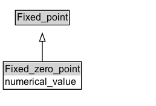

# Fixed_zero_point

**IRI**: `https://w3id.org/citydata/21972/v1/Fixed_zero_point`

## Diagram

=== "SVG (interactive)"

    <!-- Generated by graphviz version 14.1.3 (20260303.0454)
     -->
    <!-- Pages: 1 -->
    <svg width="194pt" height="132pt"
     viewBox="0.00 0.00 194.00 132.00" xmlns="http://www.w3.org/2000/svg" xmlns:xlink="http://www.w3.org/1999/xlink">
    <g id="graph0" class="graph" transform="scale(1 1) rotate(0) translate(4 128)">
    <polygon fill="white" stroke="none" points="-4,4 -4,-128 189.5,-128 189.5,4 -4,4"/>
    <g id="clust3" class="cluster">
    <title>cluster_associated</title>
    </g>
    <!-- Fixed_point -->
    <g id="node1" class="node">
    <title>Fixed_point</title>
    <g id="a_node1"><a xlink:href="../Fixed_point" xlink:title="&lt;TABLE&gt;">
    <polygon fill="lightgray" stroke="none" points="16,-97.88 16,-114.12 81,-114.12 81,-97.88 16,-97.88"/>
    <text xml:space="preserve" text-anchor="start" x="17" y="-101.88" font-family="Arial" font-size="12.00">Fixed_point</text>
    <polygon fill="none" stroke="black" points="15,-96.88 15,-115.12 82,-115.12 82,-96.88 15,-96.88"/>
    </a>
    </g>
    </g>
    <!-- Fixed_zero_point -->
    <g id="node2" class="node">
    <title>Fixed_zero_point</title>
    <g id="a_node2"><a xlink:href="../Fixed_zero_point" xlink:title="&lt;TABLE&gt;">
    <polygon fill="lightgray" stroke="none" points="1,-34 1,-50.25 96,-50.25 96,-34 1,-34"/>
    <text xml:space="preserve" text-anchor="start" x="2" y="-38" font-family="Arial" font-size="12.00">Fixed_zero_point</text>
    <text xml:space="preserve" text-anchor="start" x="2" y="-21.75" font-family="Arial" font-size="12.00">numerical_value</text>
    <polygon fill="none" stroke="black" points="0,-16.75 0,-51.25 97,-51.25 97,-16.75 0,-16.75"/>
    </a>
    </g>
    </g>
    <!-- Fixed_zero_point&#45;&gt;Fixed_point -->
    <g id="edge1" class="edge">
    <title>Fixed_zero_point&#45;&gt;Fixed_point</title>
    <path fill="none" stroke="black" d="M48.5,-51.79C48.5,-59.25 48.5,-68.24 48.5,-76.69"/>
    <polygon fill="none" stroke="black" points="45,-76.54 48.5,-86.54 52,-76.54 45,-76.54"/>
    </g>
    <!-- Invis -->
    </g>
    </svg>

=== "PNG"

    

## Formalization for Fixed_zero_point

| Property | Constraint |
|----------|------------|
| [numerical_value](../properties/numerical_value.md) | value '0' |
| subClassOf | [Fixed_point](Fixed_point.md) |

