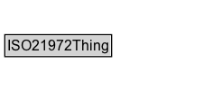

# ISO21972Thing

A class used to organise all classes defined in the ISO 21972 ontology.

**IRI**: `https://w3id.org/citydata/21972/v1/ISO21972Thing`

## Diagram

=== "SVG (interactive)"

    <!-- Generated by graphviz version 14.1.3 (20260303.0454)
     -->
    <!-- Pages: 1 -->
    <svg width="184pt" height="76pt"
     viewBox="0.00 0.00 184.00 76.00" xmlns="http://www.w3.org/2000/svg" xmlns:xlink="http://www.w3.org/1999/xlink">
    <g id="graph0" class="graph" transform="scale(1 1) rotate(0) translate(4 72)">
    <polygon fill="white" stroke="none" points="-4,4 -4,-72 180.38,-72 180.38,4 -4,4"/>
    <g id="clust3" class="cluster">
    <title>cluster_associated</title>
    </g>
    <!-- ISO21972Thing -->
    <g id="node1" class="node">
    <title>ISO21972Thing</title>
    <g id="a_node1"><a xlink:href="../ISO21972Thing" xlink:title="&lt;TABLE&gt;">
    <polygon fill="lightgray" stroke="none" points="1,-25.88 1,-42.12 87.75,-42.12 87.75,-25.88 1,-25.88"/>
    <text xml:space="preserve" text-anchor="start" x="2" y="-29.88" font-family="Arial" font-size="12.00">ISO21972Thing</text>
    <polygon fill="none" stroke="black" points="0,-24.88 0,-43.12 88.75,-43.12 88.75,-24.88 0,-24.88"/>
    </a>
    </g>
    </g>
    <!-- Invis -->
    </g>
    </svg>

=== "PNG"

    

## Specializations of ISO21972Thing

| Class | Description |
|-------|-------------|
| [Application_area](Application_area.md) |  |
| [Binary_prefix](Binary_prefix.md) |  |
| [Cardinal Scale](Cardinal_scale.md) |  |
| [Cardinality](Cardinality.md) | Cardinality of the Population.
Note that there is no property that links Cardinality to a Variable. |
| [Cardinality_scale](Cardinality_scale.md) |  |
| [Cardinality_unit](Cardinality_unit.md) |  |
| [City](City.md) |  |
| [Compound Unit](Compound_unit.md) |  |
| [Difference Indicator](DifferenceIndicator.md) | Difference between term_1 and term_2 (term_1 - term_2) |
| [Dimension](Dimension.md) |  |
| [Distinct_count](Distinct_count.md) | Distinct_count class that is a Parameter that represents
         the number of distinct values of a property of the members of a
         Population |
| [Feature](Feature.md) |  |
| [Fixed Point](Fixed_point.md) |  |
| [Fixed Zero Point](Fixed_zero_point.md) |  |
| [Indicator](Indicator.md) | An indicator is a quantity that is a ratio of a numerator and denominator that are also quantities. It has a city and time period associated with it. The numerator and denominator quantities can have different units of measure. One example of a unit of measure is the size of a population. A population_cardinality_unit is defined to be an individual of a Cardinality_unit that is a subclass of a Singular_unit. |
| [Indicator](Indicator.md) | An indicator is a quantity that is a ratio of a numerator and denominator that are also quantities. It has a city and time period associated with it. The numerator and denominator quantities can have different units of measure. One example of a unit of measure is the size of a population. A population_cardinality_unit is defined to be an individual of a Cardinality_unit that is a subclass of a Singular_unit. |
| [Interval Scale](Interval_scale.md) |  |
| [Mean](Mean.md) | Mean represents the mean value of a property all members of the Population have and is specified by the parameter_of_var property. |
| [Measure](Measure.md) | A measure combines a number to a unit of measure or an interval or ratio scale. For example, "3 m" is a measure. |
| [Measurement Scale](Measurement_scale.md) | Measurement scales are concepts used for the expression of quantities. Four types of measurement scales are: nominal scales, ordinal scales, interval scales and ratio scales. The latter two scales are also called cardinal scales. An example of a scale is the Celsius scale, a temperature scale. |
| [Measurement_scale_category](Measurement_scale_category.md) |  |
| [Monetary_unit](Monetary_unit.md) |  |
| [Monetary_unit](Monetary_unit.md) |  |
| [Nominal Scale](Nominal_scale.md) |  |
| [Observation](Observation.md) |  |
| [Ordered_measurement_scale_category](Ordered_measurement_scale_category.md) |  |
| [Ordinal Scale](Ordinal_scale.md) |  |
| [Parameter](Parameter.md) | Parameter is the Class of all  measures that can be made of a Population, both statistical, e.g., Mean, Standard_devation, and others, e.g., Cardinality, Sum. |
| [Parameter](Parameter.md) | Parameter is the Class of all  measures that can be made of a Population, both statistical, e.g., Mean, Standard_devation, and others, e.g., Cardinality, Sum. |
| [Phenomenon](Phenomenon.md) | A phenomenon is the qualitative object (e.g., food, star, molecule) that has quantifiable (standardized) aspects (e.g, length, mass, time). |
| [Point](Point.md) | A point is an element of an interval scale or a ratio scale, for example, 273.16 on the Kelvin scale indicates the triple point of water thermodynamic temperature. |
| [Population](Population.md) | The core class is the Population to be measured. A Population is linked to a parameter (e.g., mean, standard deviation, cardinality) by the is_described_by property, and the parameter is a sub class of Parameter. Depending on the subclass of Parameter, there is a reverse link back to the Population.
  
parameter links back to the using cardinality_of. parameter links back using the   property. parameter links back using the mean_of property. |
| [Prefix](Prefix.md) | A prefix is a name that precedes a basic unit of measure to indicate a decimal multiple or fraction of the unit. Each prefix has a unique symbol that is prepended to the unit symbol. For example, an electric current of 0.000 000 001 ampere is written by using the SI-prefix nano as 1 nanoampere or 1 nA. |
| [Quantity](Quantity.md) | A quantity is a representation of a quantifiable (standardized) aspect (such as length, mass, and time) of a phenomenon (e.g., a star, food, or a molecule). Quantities are classified according to similarity in (implicit) metrological aspect, e.g. the length of my speedboat and the length of my racing car are classified as length. |
| [Ratio Scale](Ratio_scale.md) |  |
| [Ratio Indicator](RatioIndicator.md) |  |
| [Sample](Sample.md) |  |
| [Sample_cardinality](Sample_cardinality.md) |  |
| [Sample_mean](Sample_mean.md) |  |
| [Sample_standard_deviation](Sample_standard_deviation.md) |  |
| [Sample_sum](Sample_sum.md) |  |
| [Si Prefix](SI_prefix.md) |  |
| [Singular_unit](Singular_unit.md) |  |
| [Standard_deviation](Standard_deviation.md) |  |
| [Statistic](Statistic.md) |  |
| [Sum](Sum.md) | Sum defines the sum over a variable possessed by members of the Population. |
| [Sum Indicator](SumIndicator.md) | Sum of term_1 and term_2 (term_1 + term_2) |
| [System_of_units](System_of_units.md) |  |
| [Unit Division](Unit_division.md) |  |
| [Unit Exponentiation](Unit_exponentiation.md) |  |
| [Unit Multiple Or Submultiple](Unit_multiple_or_submultiple.md) |  |
| [Unit Multiplication](Unit_multiplication.md) |  |
| [Unit Of Measure](Unit_of_measure.md) | A unit of measure is a definite magnitude of a quantity, defined and adopted by convention and/or by law. It is used as a standard for measurement of the same quantity, where any other value of the quantity can be expressed as a simple multiple of the unit of measure. For example, length is a quantity; the metre is a unit of length that represents a definite predetermined length. When we say 10 metre (or 10 m), we actually mean 10 times the definite predetermined length called "metre". |
| [Variable](Variable.md) | The property that is being measured in the population.  Since Protege is not Full DL, cannot make the property a subclass of Variable, so have to specify it as a string name using has_Name. |
| [Vectorial_or_tensorial_character](Vectorial_or_tensorial_character.md) |  |

## Other annotations

| Property | Value |
|----------|-------|
| [dash:abstract](https://w3id.org/citydata/imported/dash/abstract) | true |

