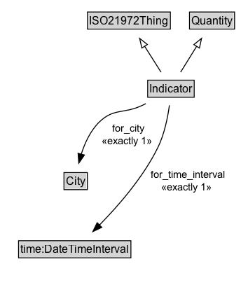

# Indicator

An indicator is a quantity that is a ratio of a numerator and denominator that are also quantities. It has a city and time period associated with it. The numerator and denominator quantities can have different units of measure. One example of a unit of measure is the size of a population. A population_cardinality_unit is defined to be an individual of a Cardinality_unit that is a subclass of a Singular_unit.

**IRI**: `https://w3id.org/citydata/21972/v1/Indicator`

## Diagram

=== "SVG (interactive)"

    <!-- Generated by graphviz version 14.1.3 (20260303.0454)
     -->
    <!-- Pages: 1 -->
    <svg width="238pt" height="401pt"
     viewBox="0.00 0.00 238.00 401.00" xmlns="http://www.w3.org/2000/svg" xmlns:xlink="http://www.w3.org/1999/xlink">
    <g id="graph0" class="graph" transform="scale(1 1) rotate(0) translate(4 397)">
    <polygon fill="white" stroke="none" points="-4,4 -4,-397 233.76,-397 233.76,4 -4,4"/>
    <g id="clust3" class="cluster">
    <title>cluster_associated</title>
    </g>
    <!-- ISO21972Thing -->
    <g id="node1" class="node">
    <title>ISO21972Thing</title>
    <g id="a_node1"><a xlink:href="../ISO21972Thing" xlink:title="&lt;TABLE&gt;">
    <polygon fill="lightgray" stroke="none" points="18.62,-366.88 18.62,-383.12 105.38,-383.12 105.38,-366.88 18.62,-366.88"/>
    <text xml:space="preserve" text-anchor="start" x="19.62" y="-370.88" font-family="Arial" font-size="12.00">ISO21972Thing</text>
    <polygon fill="none" stroke="black" points="17.62,-365.88 17.62,-384.12 106.38,-384.12 106.38,-365.88 17.62,-365.88"/>
    </a>
    </g>
    </g>
    <!-- Quantity -->
    <g id="node2" class="node">
    <title>Quantity</title>
    <g id="a_node2"><a xlink:href="../Quantity" xlink:title="&lt;TABLE&gt;">
    <polygon fill="lightgray" stroke="none" points="127.88,-366.88 127.88,-383.12 174.12,-383.12 174.12,-366.88 127.88,-366.88"/>
    <text xml:space="preserve" text-anchor="start" x="128.88" y="-370.88" font-family="Arial" font-size="12.00">Quantity</text>
    <polygon fill="none" stroke="black" points="126.88,-365.88 126.88,-384.12 175.12,-384.12 175.12,-365.88 126.88,-365.88"/>
    </a>
    </g>
    </g>
    <!-- Indicator -->
    <g id="node3" class="node">
    <title>Indicator</title>
    <g id="a_node3"><a xlink:href="../Indicator" xlink:title="&lt;TABLE&gt;">
    <polygon fill="lightgray" stroke="none" points="82.12,-293.88 82.12,-310.12 129.88,-310.12 129.88,-293.88 82.12,-293.88"/>
    <text xml:space="preserve" text-anchor="start" x="83.12" y="-297.88" font-family="Arial" font-size="12.00">Indicator</text>
    <polygon fill="none" stroke="black" points="81.12,-292.88 81.12,-311.12 130.88,-311.12 130.88,-292.88 81.12,-292.88"/>
    </a>
    </g>
    </g>
    <!-- Indicator&#45;&gt;ISO21972Thing -->
    <g id="edge1" class="edge">
    <title>Indicator&#45;&gt;ISO21972Thing</title>
    <path fill="none" stroke="black" d="M95.65,-319.71C90.51,-328 84.18,-338.21 78.4,-347.54"/>
    <polygon fill="none" stroke="black" points="75.52,-345.54 73.22,-355.89 81.47,-349.23 75.52,-345.54"/>
    </g>
    <!-- Indicator&#45;&gt;Quantity -->
    <g id="edge2" class="edge">
    <title>Indicator&#45;&gt;Quantity</title>
    <path fill="none" stroke="black" d="M116.59,-319.71C121.84,-328 128.32,-338.21 134.23,-347.54"/>
    <polygon fill="none" stroke="black" points="131.22,-349.32 139.53,-355.9 137.13,-345.58 131.22,-349.32"/>
    </g>
    <!-- Invis -->
    <!-- Indicator&#45;&gt;Invis -->
    <!-- City -->
    <g id="node5" class="node">
    <title>City</title>
    <g id="a_node5"><a xlink:href="../City" xlink:title="&lt;TABLE&gt;">
    <polygon fill="lightgray" stroke="none" points="64.5,-98.88 64.5,-115.12 87.5,-115.12 87.5,-98.88 64.5,-98.88"/>
    <text xml:space="preserve" text-anchor="start" x="65.5" y="-102.88" font-family="Arial" font-size="12.00">City</text>
    <polygon fill="none" stroke="black" points="63.5,-97.88 63.5,-116.12 88.5,-116.12 88.5,-97.88 63.5,-97.88"/>
    </a>
    </g>
    </g>
    <!-- Indicator&#45;&gt;City -->
    <g id="edge6" class="edge">
    <title>Indicator&#45;&gt;City</title>
    <path fill="none" stroke="black" d="M103.39,-284.21C98.24,-251.06 86.71,-176.89 80.37,-136.14"/>
    <polygon fill="black" stroke="black" points="83.85,-135.73 78.86,-126.38 76.94,-136.8 83.85,-135.73"/>
    <polygon fill="white" stroke="none" points="98.22,-204 98.22,-247 140.72,-247 140.72,-204 98.22,-204"/>
    <text xml:space="preserve" text-anchor="start" x="102.22" y="-232.5" font-family="Arial" font-size="11.00">for_city</text>
    <text xml:space="preserve" text-anchor="start" x="116.47" y="-211" font-family="Arial" font-size="11.00">1</text>
    </g>
    <!-- time_DateTimeInterval -->
    <g id="node6" class="node">
    <title>time_DateTimeInterval</title>
    <g id="a_node6"><a xlink:href="https://w3id.org/citydata/imported/time/latest/DateTimeInterval" xlink:title="&lt;TABLE&gt;">
    <polygon fill="lightgray" stroke="none" points="16.88,-25.88 16.88,-42.12 135.12,-42.12 135.12,-25.88 16.88,-25.88"/>
    <text xml:space="preserve" text-anchor="start" x="17.88" y="-29.88" font-family="Arial" font-size="12.00">time:DateTimeInterval</text>
    <polygon fill="none" stroke="black" points="15.88,-24.88 15.88,-43.12 136.12,-43.12 136.12,-24.88 15.88,-24.88"/>
    </a>
    </g>
    </g>
    <!-- Indicator&#45;&gt;time_DateTimeInterval -->
    <g id="edge7" class="edge">
    <title>Indicator&#45;&gt;time_DateTimeInterval</title>
    <path fill="none" stroke="black" d="M123.69,-284.44C131.86,-275.56 140.7,-263.9 145,-251.5 151.91,-231.55 147.94,-224.91 145,-204 137.59,-151.34 134.35,-137.25 112,-89 107.53,-79.34 101.45,-69.46 95.57,-60.83"/>
    <polygon fill="black" stroke="black" points="98.62,-59.08 89.98,-52.94 92.9,-63.13 98.62,-59.08"/>
    <polygon fill="white" stroke="none" points="142.26,-143 142.26,-186 229.76,-186 229.76,-143 142.26,-143"/>
    <text xml:space="preserve" text-anchor="start" x="146.26" y="-171.5" font-family="Arial" font-size="11.00">for_time_interval</text>
    <text xml:space="preserve" text-anchor="start" x="183.01" y="-150" font-family="Arial" font-size="11.00">1</text>
    </g>
    <!-- Invis&#45;&gt;City -->
    <!-- City&#45;&gt;time_DateTimeInterval -->
    </g>
    </svg>

=== "PNG"

    

## Specializations of Indicator

| Class | Description |
|-------|-------------|
| [Difference Indicator](DifferenceIndicator.md) | Difference between term_1 and term_2 (term_1 - term_2) |
| [Ratio Indicator](RatioIndicator.md) |  |
| [Sum Indicator](SumIndicator.md) | Sum of term_1 and term_2 (term_1 + term_2) |

## Formalization for Indicator

| Property | Constraint |
|----------|------------|
| [for_city](../properties/for_city.md) | exactly 1 |
| [for_city](../properties/for_city.md) | exactly 1 [City](https://w3id.org/citydata/21972/v1/City) |
| [for_time_interval](../properties/for_time_interval.md) | exactly 1 |
| [for_time_interval](../properties/for_time_interval.md) | exactly 1 [time:DateTimeInterval](http://www.w3.org/2006/time#DateTimeInterval) |
| subClassOf | [ISO21972Thing](ISO21972Thing.md) |
| subClassOf | [Quantity](Quantity.md) |

