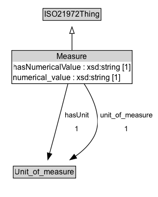

# Measure

A measure combines a number to a unit of measure or an interval or ratio scale. For example, "3 m" is a measure.

**IRI**: `https://w3id.org/citydata/21972/v1/Measure`

## Diagram

=== "SVG (interactive)"

    <!-- Generated by graphviz version 14.1.3 (20260303.0454)
     -->
    <!-- Pages: 1 -->
    <svg width="242pt" height="301pt"
     viewBox="0.00 0.00 242.00 301.00" xmlns="http://www.w3.org/2000/svg" xmlns:xlink="http://www.w3.org/1999/xlink">
    <g id="graph0" class="graph" transform="scale(1 1) rotate(0) translate(4 296.75)">
    <polygon fill="white" stroke="none" points="-4,4 -4,-296.75 237.5,-296.75 237.5,4 -4,4"/>
    <g id="clust3" class="cluster">
    <title>cluster_associated</title>
    </g>
    <!-- ISO21972Thing -->
    <g id="node1" class="node">
    <title>ISO21972Thing</title>
    <g id="a_node1"><a xlink:href="../ISO21972Thing" xlink:title="&lt;TABLE&gt;">
    <polygon fill="lightgray" stroke="none" points="62.62,-266.62 62.62,-282.88 149.38,-282.88 149.38,-266.62 62.62,-266.62"/>
    <text xml:space="preserve" text-anchor="start" x="63.62" y="-270.62" font-family="Arial" font-size="12.00">ISO21972Thing</text>
    <polygon fill="none" stroke="black" points="61.62,-265.62 61.62,-283.88 150.38,-283.88 150.38,-265.62 61.62,-265.62"/>
    </a>
    </g>
    </g>
    <!-- Measure -->
    <g id="node2" class="node">
    <title>Measure</title>
    <g id="a_node2"><a xlink:href="../Measure" xlink:title="&lt;TABLE&gt;">
    <polygon fill="lightgray" stroke="none" points="15,-202.5 15,-218.75 197,-218.75 197,-202.5 15,-202.5"/>
    <text xml:space="preserve" text-anchor="start" x="82.75" y="-206.5" font-family="Arial" font-size="12.00">Measure</text>
    <text xml:space="preserve" text-anchor="start" x="16" y="-190.25" font-family="Arial" font-size="12.00">hasNumericalValue : xsd:string [1]</text>
    <text xml:space="preserve" text-anchor="start" x="16" y="-174" font-family="Arial" font-size="12.00">numerical_value : xsd:string [1]</text>
    <polygon fill="none" stroke="black" points="14,-169 14,-219.75 198,-219.75 198,-169 14,-169"/>
    </a>
    </g>
    </g>
    <!-- Measure&#45;&gt;ISO21972Thing -->
    <g id="edge1" class="edge">
    <title>Measure&#45;&gt;ISO21972Thing</title>
    <path fill="none" stroke="black" d="M106,-219.71C106,-227.97 106,-237.27 106,-245.79"/>
    <polygon fill="none" stroke="black" points="102.5,-245.62 106,-255.62 109.5,-245.62 102.5,-245.62"/>
    </g>
    <!-- Invis -->
    <!-- Measure&#45;&gt;Invis -->
    <!-- Unit_of_measure -->
    <g id="node4" class="node">
    <title>Unit_of_measure</title>
    <g id="a_node4"><a xlink:href="../Unit_of_measure" xlink:title="&lt;TABLE&gt;">
    <polygon fill="lightgray" stroke="none" points="17.25,-25.88 17.25,-42.12 110.75,-42.12 110.75,-25.88 17.25,-25.88"/>
    <text xml:space="preserve" text-anchor="start" x="18.25" y="-29.88" font-family="Arial" font-size="12.00">Unit_of_measure</text>
    <polygon fill="none" stroke="black" points="16.25,-24.88 16.25,-43.12 111.75,-43.12 111.75,-24.88 16.25,-24.88"/>
    </a>
    </g>
    </g>
    <!-- Measure&#45;&gt;Unit_of_measure -->
    <g id="edge4" class="edge">
    <title>Measure&#45;&gt;Unit_of_measure</title>
    <path fill="none" stroke="black" d="M99.9,-169.3C94.51,-148.12 86.37,-116.48 79,-89 76.68,-80.34 74.08,-70.92 71.72,-62.41"/>
    <polygon fill="black" stroke="black" points="75.14,-61.67 69.08,-52.98 68.4,-63.55 75.14,-61.67"/>
    <polygon fill="white" stroke="none" points="91.12,-89 91.12,-132 135.87,-132 135.87,-89 91.12,-89"/>
    <text xml:space="preserve" text-anchor="start" x="95.12" y="-117.5" font-family="Arial" font-size="11.00">hasUnit</text>
    <text xml:space="preserve" text-anchor="start" x="110.49" y="-96" font-family="Arial" font-size="11.00">1</text>
    </g>
    <!-- Measure&#45;&gt;Unit_of_measure -->
    <g id="edge5" class="edge">
    <title>Measure&#45;&gt;Unit_of_measure</title>
    <path fill="none" stroke="black" d="M124.3,-169.29C138.42,-147.55 153.46,-115.08 140,-89 133.5,-76.4 122.55,-66.1 110.96,-58.01"/>
    <polygon fill="black" stroke="black" points="113.17,-55.27 102.87,-52.8 109.38,-61.16 113.17,-55.27"/>
    <polygon fill="white" stroke="none" points="145.25,-89 145.25,-132 233.5,-132 233.5,-89 145.25,-89"/>
    <text xml:space="preserve" text-anchor="start" x="149.25" y="-117.5" font-family="Arial" font-size="11.00">unit_of_measure</text>
    <text xml:space="preserve" text-anchor="start" x="186.38" y="-96" font-family="Arial" font-size="11.00">1</text>
    </g>
    <!-- Invis&#45;&gt;Unit_of_measure -->
    </g>
    </svg>

=== "PNG"

    

## Formalization for Measure

| Property | Constraint |
|----------|------------|
| [hasNumericalValue](../properties/hasNumericalValue.md) | only [xsd:string](https://w3id.org/citydata/imported/xsd/string) |
| [hasNumericalValue](../properties/hasNumericalValue.md) | exactly 1 |
| [hasNumericalValue](../properties/hasNumericalValue.md) | datatype xsd:string; exactly 1 xsd:string |
| [hasUnit](../properties/hasUnit.md) | only [Unit_of_measure](Unit_of_measure.md) |
| [hasUnit](../properties/hasUnit.md) | exactly 1 |
| [hasUnit](../properties/hasUnit.md) | exactly 1 [Unit_of_measure](https://w3id.org/citydata/21972/v1/Unit_of_measure); only [Unit_of_measure](https://w3id.org/citydata/21972/v1/Unit_of_measure) |
| [numerical_value](../properties/numerical_value.md) | only [xsd:string](https://w3id.org/citydata/imported/xsd/string) |
| [numerical_value](../properties/numerical_value.md) | exactly 1 |
| [numerical_value](../properties/numerical_value.md) | datatype xsd:string; exactly 1 xsd:string |
| [unit_of_measure](../properties/unit_of_measure.md) | only [Unit_of_measure](Unit_of_measure.md) |
| [unit_of_measure](../properties/unit_of_measure.md) | exactly 1 |
| [unit_of_measure](../properties/unit_of_measure.md) | exactly 1 [Unit_of_measure](https://w3id.org/citydata/21972/v1/Unit_of_measure); only [Unit_of_measure](https://w3id.org/citydata/21972/v1/Unit_of_measure) |
| subClassOf | [ISO21972Thing](ISO21972Thing.md) |

