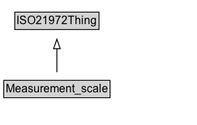

# Measurement_scale

Measurement scales are concepts used for the expression of quantities. Four types of measurement scales are: nominal scales, ordinal scales, interval scales and ratio scales. The latter two scales are also called cardinal scales. An example of a scale is the Celsius scale, a temperature scale.

**IRI**: `https://w3id.org/citydata/21972/v1/Measurement_scale`

## Diagram

=== "SVG (interactive)"

    <!-- Generated by graphviz version 14.1.3 (20260303.0454)
     -->
    <!-- Pages: 1 -->
    <svg width="208pt" height="132pt"
     viewBox="0.00 0.00 208.00 132.00" xmlns="http://www.w3.org/2000/svg" xmlns:xlink="http://www.w3.org/1999/xlink">
    <g id="graph0" class="graph" transform="scale(1 1) rotate(0) translate(4 128)">
    <polygon fill="white" stroke="none" points="-4,4 -4,-128 204,-128 204,4 -4,4"/>
    <g id="clust3" class="cluster">
    <title>cluster_associated</title>
    </g>
    <!-- ISO21972Thing -->
    <g id="node1" class="node">
    <title>ISO21972Thing</title>
    <g id="a_node1"><a xlink:href="../ISO21972Thing" xlink:title="&lt;TABLE&gt;">
    <polygon fill="lightgray" stroke="none" points="12.62,-97.88 12.62,-114.12 99.38,-114.12 99.38,-97.88 12.62,-97.88"/>
    <text xml:space="preserve" text-anchor="start" x="13.62" y="-101.88" font-family="Arial" font-size="12.00">ISO21972Thing</text>
    <polygon fill="none" stroke="black" points="11.62,-96.88 11.62,-115.12 100.38,-115.12 100.38,-96.88 11.62,-96.88"/>
    </a>
    </g>
    </g>
    <!-- Measurement_scale -->
    <g id="node2" class="node">
    <title>Measurement_scale</title>
    <g id="a_node2"><a xlink:href="../Measurement_scale" xlink:title="&lt;TABLE&gt;">
    <polygon fill="lightgray" stroke="none" points="1,-25.88 1,-42.12 111,-42.12 111,-25.88 1,-25.88"/>
    <text xml:space="preserve" text-anchor="start" x="2" y="-29.88" font-family="Arial" font-size="12.00">Measurement_scale</text>
    <polygon fill="none" stroke="black" points="0,-24.88 0,-43.12 112,-43.12 112,-24.88 0,-24.88"/>
    </a>
    </g>
    </g>
    <!-- Measurement_scale&#45;&gt;ISO21972Thing -->
    <g id="edge1" class="edge">
    <title>Measurement_scale&#45;&gt;ISO21972Thing</title>
    <path fill="none" stroke="black" d="M56,-51.79C56,-59.25 56,-68.24 56,-76.69"/>
    <polygon fill="none" stroke="black" points="52.5,-76.54 56,-86.54 59.5,-76.54 52.5,-76.54"/>
    </g>
    <!-- Invis -->
    </g>
    </svg>

=== "PNG"

    

## Specializations of Measurement_scale

| Class | Description |
|-------|-------------|
| [Cardinal Scale](Cardinal_scale.md) |  |
| [Cardinality_scale](Cardinality_scale.md) |  |
| [Interval Scale](Interval_scale.md) |  |
| [Nominal Scale](Nominal_scale.md) |  |
| [Ordinal Scale](Ordinal_scale.md) |  |
| [Ratio Scale](Ratio_scale.md) |  |

## Formalization for Measurement_scale

| Property | Constraint |
|----------|------------|
| subClassOf | [ISO21972Thing](ISO21972Thing.md) |

## Other annotations

| Property | Value |
|----------|-------|
| [om-1:alternative_label](https://w3id.org/citydata/imported/om-1/alternative_label) | scale |

