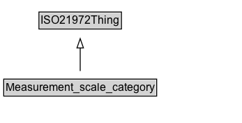

# Measurement_scale_category

## Diagram

=== "SVG (interactive)"

    <!-- Generated by graphviz version 14.1.3 (20260303.0454)
     -->
    <!-- Pages: 1 -->
    <svg width="260pt" height="132pt"
     viewBox="0.00 0.00 260.00 132.00" xmlns="http://www.w3.org/2000/svg" xmlns:xlink="http://www.w3.org/1999/xlink">
    <g id="graph0" class="graph" transform="scale(1 1) rotate(0) translate(4 128)">
    <polygon fill="white" stroke="none" points="-4,4 -4,-128 256.25,-128 256.25,4 -4,4"/>
    <g id="clust3" class="cluster">
    <title>cluster_associated</title>
    </g>
    <!-- ISO21972Thing -->
    <g id="node1" class="node">
    <title>ISO21972Thing</title>
    <g id="a_node1"><a xlink:href="../ISO21972Thing" xlink:title="&lt;TABLE&gt;">
    <polygon fill="lightgray" stroke="none" points="38.88,-97.88 38.88,-114.12 125.62,-114.12 125.62,-97.88 38.88,-97.88"/>
    <text xml:space="preserve" text-anchor="start" x="39.88" y="-101.88" font-family="Arial" font-size="12.00">ISO21972Thing</text>
    <polygon fill="none" stroke="black" points="37.88,-96.88 37.88,-115.12 126.62,-115.12 126.62,-96.88 37.88,-96.88"/>
    </a>
    </g>
    </g>
    <!-- Measurement_scale_category -->
    <g id="node2" class="node">
    <title>Measurement_scale_category</title>
    <g id="a_node2"><a xlink:href="../Measurement_scale_category" xlink:title="&lt;TABLE&gt;">
    <polygon fill="lightgray" stroke="none" points="1,-25.88 1,-42.12 163.5,-42.12 163.5,-25.88 1,-25.88"/>
    <text xml:space="preserve" text-anchor="start" x="2" y="-29.88" font-family="Arial" font-size="12.00">Measurement_scale_category</text>
    <polygon fill="none" stroke="black" points="0,-24.88 0,-43.12 164.5,-43.12 164.5,-24.88 0,-24.88"/>
    </a>
    </g>
    </g>
    <!-- Measurement_scale_category&#45;&gt;ISO21972Thing -->
    <g id="edge1" class="edge">
    <title>Measurement_scale_category&#45;&gt;ISO21972Thing</title>
    <path fill="none" stroke="black" d="M82.25,-51.79C82.25,-59.25 82.25,-68.24 82.25,-76.69"/>
    <polygon fill="none" stroke="black" points="78.75,-76.54 82.25,-86.54 85.75,-76.54 78.75,-76.54"/>
    </g>
    <!-- Invis -->
    </g>
    </svg>

=== "PNG"

    

## Formalization for Measurement_scale_category

| Property | Constraint |
|----------|------------|
| subClassOf | [ISO21972Thing](ISO21972Thing.md) |

