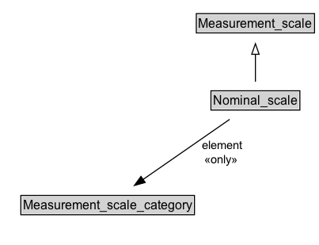

# Nominal_scale

**IRI**: `https://w3id.org/citydata/21972/v1/Nominal_scale`

## Diagram

=== "SVG (interactive)"

    <!-- Generated by graphviz version 14.1.3 (20260303.0454)
     -->
    <!-- Pages: 1 -->
    <svg width="204pt" height="279pt"
     viewBox="0.00 0.00 204.00 279.00" xmlns="http://www.w3.org/2000/svg" xmlns:xlink="http://www.w3.org/1999/xlink">
    <g id="graph0" class="graph" transform="scale(1 1) rotate(0) translate(4 275)">
    <polygon fill="white" stroke="none" points="-4,4 -4,-275 200,-275 200,4 -4,4"/>
    <g id="clust3" class="cluster">
    <title>cluster_associated</title>
    </g>
    <!-- Measurement_scale -->
    <g id="node1" class="node">
    <title>Measurement_scale</title>
    <g id="a_node1"><a xlink:href="../Measurement_scale" xlink:title="&lt;TABLE&gt;">
    <polygon fill="lightgray" stroke="none" points="46,-244.88 46,-261.12 156,-261.12 156,-244.88 46,-244.88"/>
    <text xml:space="preserve" text-anchor="start" x="47" y="-248.88" font-family="Arial" font-size="12.00">Measurement_scale</text>
    <polygon fill="none" stroke="black" points="45,-243.88 45,-262.12 157,-262.12 157,-243.88 45,-243.88"/>
    </a>
    </g>
    </g>
    <!-- Nominal_scale -->
    <g id="node2" class="node">
    <title>Nominal_scale</title>
    <g id="a_node2"><a xlink:href="../Nominal_scale" xlink:title="&lt;TABLE&gt;">
    <polygon fill="lightgray" stroke="none" points="59.88,-171.88 59.88,-188.12 142.12,-188.12 142.12,-171.88 59.88,-171.88"/>
    <text xml:space="preserve" text-anchor="start" x="60.88" y="-175.88" font-family="Arial" font-size="12.00">Nominal_scale</text>
    <polygon fill="none" stroke="black" points="58.88,-170.88 58.88,-189.12 143.12,-189.12 143.12,-170.88 58.88,-170.88"/>
    </a>
    </g>
    </g>
    <!-- Nominal_scale&#45;&gt;Measurement_scale -->
    <g id="edge1" class="edge">
    <title>Nominal_scale&#45;&gt;Measurement_scale</title>
    <path fill="none" stroke="black" d="M101,-197.71C101,-205.47 101,-214.92 101,-223.74"/>
    <polygon fill="none" stroke="black" points="97.5,-223.66 101,-233.66 104.5,-223.66 97.5,-223.66"/>
    </g>
    <!-- Invis -->
    <!-- Nominal_scale&#45;&gt;Invis -->
    <!-- Measurement_scale_category -->
    <g id="node4" class="node">
    <title>Measurement_scale_category</title>
    <g id="a_node4"><a xlink:href="../Measurement_scale_category" xlink:title="&lt;TABLE&gt;">
    <polygon fill="lightgray" stroke="none" points="16.75,-25.88 16.75,-42.12 179.25,-42.12 179.25,-25.88 16.75,-25.88"/>
    <text xml:space="preserve" text-anchor="start" x="17.75" y="-29.88" font-family="Arial" font-size="12.00">Measurement_scale_category</text>
    <polygon fill="none" stroke="black" points="15.75,-24.88 15.75,-43.12 180.25,-43.12 180.25,-24.88 15.75,-24.88"/>
    </a>
    </g>
    </g>
    <!-- Nominal_scale&#45;&gt;Measurement_scale_category -->
    <g id="edge4" class="edge">
    <title>Nominal_scale&#45;&gt;Measurement_scale_category</title>
    <path fill="none" stroke="black" d="M103.24,-162.43C104.31,-153.69 105.47,-142.79 106,-133 107.06,-113.47 107.44,-108.5 106,-89 105.38,-80.62 104.23,-71.56 102.99,-63.31"/>
    <polygon fill="black" stroke="black" points="106.45,-62.76 101.41,-53.45 99.54,-63.88 106.45,-62.76"/>
    <polygon fill="white" stroke="none" points="106.94,-96.25 106.94,-117.75 153.19,-117.75 153.19,-96.25 106.94,-96.25"/>
    <text xml:space="preserve" text-anchor="start" x="110.94" y="-103.25" font-family="Arial" font-size="11.00">element</text>
    </g>
    <!-- Invis&#45;&gt;Measurement_scale_category -->
    </g>
    </svg>

=== "PNG"

    

## Formalization for Nominal_scale

| Property | Constraint |
|----------|------------|
| [element](../properties/element.md) | only [Measurement_scale_category](Measurement_scale_category.md) |
| [element](../properties/element.md) | only [Measurement_scale_category](https://w3id.org/citydata/21972/v1/Measurement_scale_category) |
| subClassOf | [Measurement_scale](Measurement_scale.md) |

