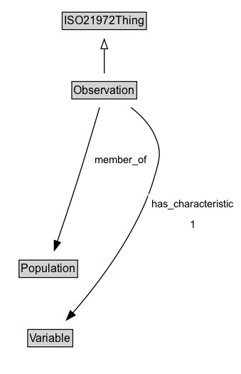

# Observation

## Diagram

=== "SVG (interactive)"

    <!-- Generated by graphviz version 14.1.3 (20260303.0454)
     -->
    <!-- Pages: 1 -->
    <svg width="255pt" height="394pt"
     viewBox="0.00 0.00 255.00 394.00" xmlns="http://www.w3.org/2000/svg" xmlns:xlink="http://www.w3.org/1999/xlink">
    <g id="graph0" class="graph" transform="scale(1 1) rotate(0) translate(4 390)">
    <polygon fill="white" stroke="none" points="-4,4 -4,-390 250.53,-390 250.53,4 -4,4"/>
    <g id="clust3" class="cluster">
    <title>cluster_associated</title>
    </g>
    <!-- ISO21972Thing -->
    <g id="node1" class="node">
    <title>ISO21972Thing</title>
    <g id="a_node1"><a xlink:href="../ISO21972Thing" xlink:title="&lt;TABLE&gt;">
    <polygon fill="lightgray" stroke="none" points="62.62,-359.88 62.62,-376.12 149.38,-376.12 149.38,-359.88 62.62,-359.88"/>
    <text xml:space="preserve" text-anchor="start" x="63.62" y="-363.88" font-family="Arial" font-size="12.00">ISO21972Thing</text>
    <polygon fill="none" stroke="black" points="61.62,-358.88 61.62,-377.12 150.38,-377.12 150.38,-358.88 61.62,-358.88"/>
    </a>
    </g>
    </g>
    <!-- Observation -->
    <g id="node2" class="node">
    <title>Observation</title>
    <g id="a_node2"><a xlink:href="../Observation" xlink:title="&lt;TABLE&gt;">
    <polygon fill="lightgray" stroke="none" points="72.75,-286.88 72.75,-303.12 139.25,-303.12 139.25,-286.88 72.75,-286.88"/>
    <text xml:space="preserve" text-anchor="start" x="73.75" y="-290.88" font-family="Arial" font-size="12.00">Observation</text>
    <polygon fill="none" stroke="black" points="71.75,-285.88 71.75,-304.12 140.25,-304.12 140.25,-285.88 71.75,-285.88"/>
    </a>
    </g>
    </g>
    <!-- Observation&#45;&gt;ISO21972Thing -->
    <g id="edge1" class="edge">
    <title>Observation&#45;&gt;ISO21972Thing</title>
    <path fill="none" stroke="black" d="M106,-312.71C106,-320.47 106,-329.92 106,-338.74"/>
    <polygon fill="none" stroke="black" points="102.5,-338.66 106,-348.66 109.5,-338.66 102.5,-338.66"/>
    </g>
    <!-- Invis -->
    <!-- Observation&#45;&gt;Invis -->
    <!-- Population -->
    <g id="node4" class="node">
    <title>Population</title>
    <g id="a_node4"><a xlink:href="../Population" xlink:title="&lt;TABLE&gt;">
    <polygon fill="lightgray" stroke="none" points="17.12,-98.88 17.12,-115.12 76.88,-115.12 76.88,-98.88 17.12,-98.88"/>
    <text xml:space="preserve" text-anchor="start" x="18.12" y="-102.88" font-family="Arial" font-size="12.00">Population</text>
    <polygon fill="none" stroke="black" points="16.12,-97.88 16.12,-116.12 77.88,-116.12 77.88,-97.88 16.12,-97.88"/>
    </a>
    </g>
    </g>
    <!-- Observation&#45;&gt;Population -->
    <g id="edge5" class="edge">
    <title>Observation&#45;&gt;Population</title>
    <path fill="none" stroke="black" d="M101.08,-277.03C95.78,-258.91 87.03,-229.35 79,-204 71.68,-180.87 62.94,-154.75 56.45,-135.61"/>
    <polygon fill="black" stroke="black" points="59.84,-134.72 53.31,-126.38 53.22,-136.97 59.84,-134.72"/>
    <polygon fill="white" stroke="none" points="92.4,-211.25 92.4,-232.75 155.15,-232.75 155.15,-211.25 92.4,-211.25"/>
    <text xml:space="preserve" text-anchor="start" x="96.4" y="-218.25" font-family="Arial" font-size="11.00">member_of</text>
    </g>
    <!-- Variable -->
    <g id="node5" class="node">
    <title>Variable</title>
    <g id="a_node5"><a xlink:href="../Variable" xlink:title="&lt;TABLE&gt;">
    <polygon fill="lightgray" stroke="none" points="26.25,-25.88 26.25,-42.12 71.75,-42.12 71.75,-25.88 26.25,-25.88"/>
    <text xml:space="preserve" text-anchor="start" x="27.25" y="-29.88" font-family="Arial" font-size="12.00">Variable</text>
    <polygon fill="none" stroke="black" points="25.25,-24.88 25.25,-43.12 72.75,-43.12 72.75,-24.88 25.25,-24.88"/>
    </a>
    </g>
    </g>
    <!-- Observation&#45;&gt;Variable -->
    <g id="edge6" class="edge">
    <title>Observation&#45;&gt;Variable</title>
    <path fill="none" stroke="black" d="M134.02,-277.02C143.82,-269.47 153.69,-259.64 159,-248 167.12,-230.21 164.4,-222.8 159,-204 142.64,-147.04 99.81,-91.51 72.68,-60.43"/>
    <polygon fill="black" stroke="black" points="75.41,-58.23 66.15,-53.09 70.18,-62.89 75.41,-58.23"/>
    <polygon fill="white" stroke="none" points="152.28,-143 152.28,-186 246.53,-186 246.53,-143 152.28,-143"/>
    <text xml:space="preserve" text-anchor="start" x="156.28" y="-171.5" font-family="Arial" font-size="11.00">has_characteristic</text>
    <text xml:space="preserve" text-anchor="start" x="196.41" y="-150" font-family="Arial" font-size="11.00">1</text>
    </g>
    <!-- Invis&#45;&gt;Population -->
    <!-- Population&#45;&gt;Variable -->
    </g>
    </svg>

=== "PNG"

    

## Formalization for Observation

| Property | Constraint |
|----------|------------|
| [has_characteristic](../properties/has_characteristic.md) | exactly 1 |
| [has_characteristic](../properties/has_characteristic.md) | exactly 1 [Variable](https://w3id.org/citydata/21972/v1/Variable) |
| [member_of](../properties/member_of.md) | only [Population](https://w3id.org/citydata/21972/v1/Population) |
| subClassOf | [ISO21972Thing](ISO21972Thing.md) |

