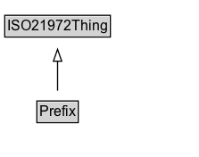

# Prefix

A prefix is a name that precedes a basic unit of measure to indicate a decimal multiple or fraction of the unit. Each prefix has a unique symbol that is prepended to the unit symbol. For example, an electric current of 0.000 000 001 ampere is written by using the SI-prefix nano as 1 nanoampere or 1 nA.

## Diagram

=== "SVG (interactive)"

    <!-- Generated by graphviz version 14.1.3 (20260303.0454)
     -->
    <!-- Pages: 1 -->
    <svg width="167pt" height="132pt"
     viewBox="0.00 0.00 167.00 132.00" xmlns="http://www.w3.org/2000/svg" xmlns:xlink="http://www.w3.org/1999/xlink">
    <g id="graph0" class="graph" transform="scale(1 1) rotate(0) translate(4 128)">
    <polygon fill="white" stroke="none" points="-4,4 -4,-128 163.38,-128 163.38,4 -4,4"/>
    <g id="clust3" class="cluster">
    <title>cluster_associated</title>
    </g>
    <!-- ISO21972Thing -->
    <g id="node1" class="node">
    <title>ISO21972Thing</title>
    <g id="a_node1"><a xlink:href="../ISO21972Thing" xlink:title="&lt;TABLE&gt;">
    <polygon fill="lightgray" stroke="none" points="1,-97.88 1,-114.12 87.75,-114.12 87.75,-97.88 1,-97.88"/>
    <text xml:space="preserve" text-anchor="start" x="2" y="-101.88" font-family="Arial" font-size="12.00">ISO21972Thing</text>
    <polygon fill="none" stroke="black" points="0,-96.88 0,-115.12 88.75,-115.12 88.75,-96.88 0,-96.88"/>
    </a>
    </g>
    </g>
    <!-- Prefix -->
    <g id="node2" class="node">
    <title>Prefix</title>
    <g id="a_node2"><a xlink:href="../Prefix" xlink:title="&lt;TABLE&gt;">
    <polygon fill="lightgray" stroke="none" points="28,-25.88 28,-42.12 60.75,-42.12 60.75,-25.88 28,-25.88"/>
    <text xml:space="preserve" text-anchor="start" x="29" y="-29.88" font-family="Arial" font-size="12.00">Prefix</text>
    <polygon fill="none" stroke="black" points="27,-24.88 27,-43.12 61.75,-43.12 61.75,-24.88 27,-24.88"/>
    </a>
    </g>
    </g>
    <!-- Prefix&#45;&gt;ISO21972Thing -->
    <g id="edge1" class="edge">
    <title>Prefix&#45;&gt;ISO21972Thing</title>
    <path fill="none" stroke="black" d="M44.38,-51.79C44.38,-59.25 44.38,-68.24 44.38,-76.69"/>
    <polygon fill="none" stroke="black" points="40.88,-76.54 44.38,-86.54 47.88,-76.54 40.88,-76.54"/>
    </g>
    <!-- Invis -->
    </g>
    </svg>

=== "PNG"

    

## Specializations of Prefix

| Class | Description |
|-------|-------------|
| [Si Prefix](SI_prefix.md) |  |

## Formalization for Prefix

| Property | Constraint |
|----------|------------|
| subClassOf | [ISO21972Thing](ISO21972Thing.md) |

