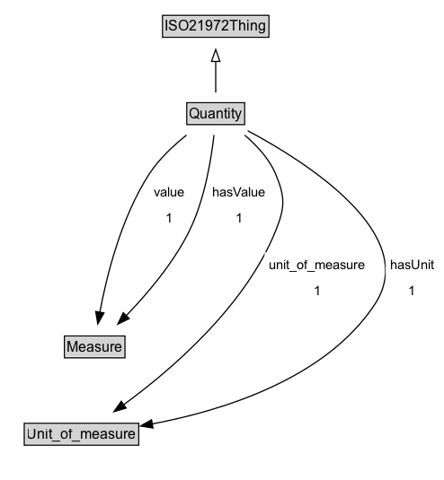

# Quantity

A quantity is a representation of a quantifiable (standardized) aspect (such as length, mass, and time) of a phenomenon (e.g., a star, food, or a molecule). Quantities are classified according to similarity in (implicit) metrological aspect, e.g. the length of my speedboat and the length of my racing car are classified as length.

## Diagram

=== "SVG (interactive)"

    <!-- Generated by graphviz version 14.1.3 (20260303.0454)
     -->
    <!-- Pages: 1 -->
    <svg width="370pt" height="401pt"
     viewBox="0.00 0.00 370.00 401.00" xmlns="http://www.w3.org/2000/svg" xmlns:xlink="http://www.w3.org/1999/xlink">
    <g id="graph0" class="graph" transform="scale(1 1) rotate(0) translate(4 397)">
    <polygon fill="white" stroke="none" points="-4,4 -4,-397 366.44,-397 366.44,4 -4,4"/>
    <g id="clust3" class="cluster">
    <title>cluster_associated</title>
    </g>
    <!-- ISO21972Thing -->
    <g id="node1" class="node">
    <title>ISO21972Thing</title>
    <g id="a_node1"><a xlink:href="../ISO21972Thing" xlink:title="&lt;TABLE&gt;">
    <polygon fill="lightgray" stroke="none" points="132.62,-366.88 132.62,-383.12 219.38,-383.12 219.38,-366.88 132.62,-366.88"/>
    <text xml:space="preserve" text-anchor="start" x="133.62" y="-370.88" font-family="Arial" font-size="12.00">ISO21972Thing</text>
    <polygon fill="none" stroke="black" points="131.62,-365.88 131.62,-384.12 220.38,-384.12 220.38,-365.88 131.62,-365.88"/>
    </a>
    </g>
    </g>
    <!-- Quantity -->
    <g id="node2" class="node">
    <title>Quantity</title>
    <g id="a_node2"><a xlink:href="../Quantity" xlink:title="&lt;TABLE&gt;">
    <polygon fill="lightgray" stroke="none" points="152.88,-293.88 152.88,-310.12 199.12,-310.12 199.12,-293.88 152.88,-293.88"/>
    <text xml:space="preserve" text-anchor="start" x="153.88" y="-297.88" font-family="Arial" font-size="12.00">Quantity</text>
    <polygon fill="none" stroke="black" points="151.88,-292.88 151.88,-311.12 200.12,-311.12 200.12,-292.88 151.88,-292.88"/>
    </a>
    </g>
    </g>
    <!-- Quantity&#45;&gt;ISO21972Thing -->
    <g id="edge1" class="edge">
    <title>Quantity&#45;&gt;ISO21972Thing</title>
    <path fill="none" stroke="black" d="M176,-319.71C176,-327.47 176,-336.92 176,-345.74"/>
    <polygon fill="none" stroke="black" points="172.5,-345.66 176,-355.66 179.5,-345.66 172.5,-345.66"/>
    </g>
    <!-- Invis -->
    <!-- Quantity&#45;&gt;Invis -->
    <!-- Measure -->
    <g id="node4" class="node">
    <title>Measure</title>
    <g id="a_node4"><a xlink:href="../Measure" xlink:title="&lt;TABLE&gt;">
    <polygon fill="lightgray" stroke="none" points="50.75,-98.88 50.75,-115.12 99.25,-115.12 99.25,-98.88 50.75,-98.88"/>
    <text xml:space="preserve" text-anchor="start" x="51.75" y="-102.88" font-family="Arial" font-size="12.00">Measure</text>
    <polygon fill="none" stroke="black" points="49.75,-97.88 49.75,-116.12 100.25,-116.12 100.25,-97.88 49.75,-97.88"/>
    </a>
    </g>
    </g>
    <!-- Quantity&#45;&gt;Measure -->
    <g id="edge6" class="edge">
    <title>Quantity&#45;&gt;Measure</title>
    <path fill="none" stroke="black" d="M151.66,-284.06C140.8,-275.41 128.64,-264.07 120.5,-251.5 97.04,-215.29 84.92,-166.1 79.26,-135.74"/>
    <polygon fill="black" stroke="black" points="82.77,-135.46 77.6,-126.21 75.87,-136.66 82.77,-135.46"/>
    <polygon fill="white" stroke="none" points="120.5,-204 120.5,-247 154,-247 154,-204 120.5,-204"/>
    <text xml:space="preserve" text-anchor="start" x="124.5" y="-232.5" font-family="Arial" font-size="11.00">value</text>
    <text xml:space="preserve" text-anchor="start" x="134.25" y="-211" font-family="Arial" font-size="11.00">1</text>
    </g>
    <!-- Quantity&#45;&gt;Measure -->
    <g id="edge7" class="edge">
    <title>Quantity&#45;&gt;Measure</title>
    <path fill="none" stroke="black" d="M174.56,-284.08C172.32,-264.08 166.85,-230.2 154,-204 140.74,-176.94 118.44,-150.84 100.91,-132.71"/>
    <polygon fill="black" stroke="black" points="103.83,-130.68 94.31,-126.03 98.86,-135.6 103.83,-130.68"/>
    <polygon fill="white" stroke="none" points="169.29,-204 169.29,-247 221.54,-247 221.54,-204 169.29,-204"/>
    <text xml:space="preserve" text-anchor="start" x="173.29" y="-232.5" font-family="Arial" font-size="11.00">hasValue</text>
    <text xml:space="preserve" text-anchor="start" x="192.41" y="-211" font-family="Arial" font-size="11.00">1</text>
    </g>
    <!-- Unit_of_measure -->
    <g id="node5" class="node">
    <title>Unit_of_measure</title>
    <g id="a_node5"><a xlink:href="../Unit_of_measure" xlink:title="&lt;TABLE&gt;">
    <polygon fill="lightgray" stroke="none" points="17.25,-25.88 17.25,-42.12 110.75,-42.12 110.75,-25.88 17.25,-25.88"/>
    <text xml:space="preserve" text-anchor="start" x="18.25" y="-29.88" font-family="Arial" font-size="12.00">Unit_of_measure</text>
    <polygon fill="none" stroke="black" points="16.25,-24.88 16.25,-43.12 111.75,-43.12 111.75,-24.88 16.25,-24.88"/>
    </a>
    </g>
    </g>
    <!-- Quantity&#45;&gt;Unit_of_measure -->
    <g id="edge5" class="edge">
    <title>Quantity&#45;&gt;Unit_of_measure</title>
    <path fill="none" stroke="black" d="M200.14,-284.07C210.14,-275.57 220.64,-264.35 226,-251.5 234.13,-232.02 233.87,-223.59 226,-204 200.46,-140.46 138.37,-87.35 98.89,-58.47"/>
    <polygon fill="black" stroke="black" points="101.26,-55.86 91.1,-52.88 97.19,-61.55 101.26,-55.86"/>
    <polygon fill="white" stroke="none" points="216.8,-143 216.8,-186 305.05,-186 305.05,-143 216.8,-143"/>
    <text xml:space="preserve" text-anchor="start" x="220.8" y="-171.5" font-family="Arial" font-size="11.00">unit_of_measure</text>
    <text xml:space="preserve" text-anchor="start" x="257.92" y="-150" font-family="Arial" font-size="11.00">1</text>
    </g>
    <!-- Quantity&#45;&gt;Unit_of_measure -->
    <g id="edge8" class="edge">
    <title>Quantity&#45;&gt;Unit_of_measure</title>
    <path fill="none" stroke="black" d="M202.69,-287.74C251.52,-261.65 346.89,-201.12 309,-143 268.06,-80.21 181.49,-53.67 123.02,-42.63"/>
    <polygon fill="black" stroke="black" points="123.67,-39.19 113.21,-40.89 122.44,-46.08 123.67,-39.19"/>
    <polygon fill="white" stroke="none" points="317.69,-143 317.69,-186 362.44,-186 362.44,-143 317.69,-143"/>
    <text xml:space="preserve" text-anchor="start" x="321.69" y="-171.5" font-family="Arial" font-size="11.00">hasUnit</text>
    <text xml:space="preserve" text-anchor="start" x="337.06" y="-150" font-family="Arial" font-size="11.00">1</text>
    </g>
    <!-- Invis&#45;&gt;Measure -->
    <!-- Measure&#45;&gt;Unit_of_measure -->
    </g>
    </svg>

=== "PNG"

    

## Specializations of Quantity

| Class | Description |
|-------|-------------|
| [Cardinality](Cardinality.md) | Cardinality of the Population.
Note that there is no property that links Cardinality to a Variable. |
| [Difference Indicator](DifferenceIndicator.md) | Difference between term_1 and term_2 (term_1 - term_2) |
| [Distinct_count](Distinct_count.md) | Distinct_count class that is a Parameter that represents
         the number of distinct values of a property of the members of a
         Population |
| [Indicator](Indicator.md) | An indicator is a quantity that is a ratio of a numerator and denominator that are also quantities. It has a city and time period associated with it. The numerator and denominator quantities can have different units of measure. One example of a unit of measure is the size of a population. A population_cardinality_unit is defined to be an individual of a Cardinality_unit that is a subclass of a Singular_unit. |
| [Mean](Mean.md) | Mean represents the mean value of a property all members of the Population have and is specified by the parameter_of_var property. |
| [Parameter](Parameter.md) | Parameter is the Class of all  measures that can be made of a Population, both statistical, e.g., Mean, Starndard_devation, and others, e.g., Cardinality, Sum. |
| [Ratio Indicator](RatioIndicator.md) |  |
| [Standard_deviation](Standard_deviation.md) |  |
| [Sum](Sum.md) | Sum defines the sum over a variable possessed by members of the Population. |
| [Sum Indicator](SumIndicator.md) | Sum of term_1 and term_2 (term_1 + term_2) |

## Formalization for Quantity

| Property | Constraint |
|----------|------------|
| [hasUnit](../properties/hasUnit.md) | exactly 1 |
| [hasUnit](../properties/hasUnit.md) | exactly 1 [Unit_of_measure](https://w3id.org/citydata/21972/v1/Unit_of_measure); only [Unit_of_measure](https://w3id.org/citydata/21972/v1/Unit_of_measure) |
| [hasValue](../properties/hasValue.md) | exactly 1 |
| [hasValue](../properties/hasValue.md) | only [Measure](https://w3id.org/citydata/21972/v1/Measure); exactly 1 [Measure](https://w3id.org/citydata/21972/v1/Measure) |
| [unit_of_measure](../properties/unit_of_measure.md) | exactly 1 |
| [unit_of_measure](../properties/unit_of_measure.md) | exactly 1 [Unit_of_measure](https://w3id.org/citydata/21972/v1/Unit_of_measure); only [Unit_of_measure](https://w3id.org/citydata/21972/v1/Unit_of_measure) |
| [value](../properties/value.md) | exactly 1 |
| [value](../properties/value.md) | only [Measure](https://w3id.org/citydata/21972/v1/Measure); exactly 1 [Measure](https://w3id.org/citydata/21972/v1/Measure) |
| subClassOf | [ISO21972Thing](ISO21972Thing.md) |

