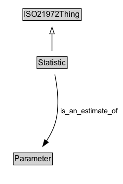

# Statistic

**IRI**: `https://w3id.org/citydata/21972/v1/Statistic`

## Diagram

=== "SVG (interactive)"

    <!-- Generated by graphviz version 14.1.3 (20260303.0454)
     -->
    <!-- Pages: 1 -->
    <svg width="187pt" height="279pt"
     viewBox="0.00 0.00 187.00 279.00" xmlns="http://www.w3.org/2000/svg" xmlns:xlink="http://www.w3.org/1999/xlink">
    <g id="graph0" class="graph" transform="scale(1 1) rotate(0) translate(4 275)">
    <polygon fill="white" stroke="none" points="-4,4 -4,-275 182.91,-275 182.91,4 -4,4"/>
    <g id="clust3" class="cluster">
    <title>cluster_associated</title>
    </g>
    <!-- ISO21972Thing -->
    <g id="node1" class="node">
    <title>ISO21972Thing</title>
    <g id="a_node1"><a xlink:href="../ISO21972Thing" xlink:title="&lt;TABLE&gt;">
    <polygon fill="lightgray" stroke="none" points="31.62,-244.88 31.62,-261.12 118.38,-261.12 118.38,-244.88 31.62,-244.88"/>
    <text xml:space="preserve" text-anchor="start" x="32.62" y="-248.88" font-family="Arial" font-size="12.00">ISO21972Thing</text>
    <polygon fill="none" stroke="black" points="30.62,-243.88 30.62,-262.12 119.38,-262.12 119.38,-243.88 30.62,-243.88"/>
    </a>
    </g>
    </g>
    <!-- Statistic -->
    <g id="node2" class="node">
    <title>Statistic</title>
    <g id="a_node2"><a xlink:href="../Statistic" xlink:title="&lt;TABLE&gt;">
    <polygon fill="lightgray" stroke="none" points="53,-171.88 53,-188.12 97,-188.12 97,-171.88 53,-171.88"/>
    <text xml:space="preserve" text-anchor="start" x="54" y="-175.88" font-family="Arial" font-size="12.00">Statistic</text>
    <polygon fill="none" stroke="black" points="52,-170.88 52,-189.12 98,-189.12 98,-170.88 52,-170.88"/>
    </a>
    </g>
    </g>
    <!-- Statistic&#45;&gt;ISO21972Thing -->
    <g id="edge1" class="edge">
    <title>Statistic&#45;&gt;ISO21972Thing</title>
    <path fill="none" stroke="black" d="M75,-197.71C75,-205.47 75,-214.92 75,-223.74"/>
    <polygon fill="none" stroke="black" points="71.5,-223.66 75,-233.66 78.5,-223.66 71.5,-223.66"/>
    </g>
    <!-- Invis -->
    <!-- Statistic&#45;&gt;Invis -->
    <!-- Parameter -->
    <g id="node4" class="node">
    <title>Parameter</title>
    <g id="a_node4"><a xlink:href="../Parameter" xlink:title="&lt;TABLE&gt;">
    <polygon fill="lightgray" stroke="none" points="17.25,-25.88 17.25,-42.12 74.75,-42.12 74.75,-25.88 17.25,-25.88"/>
    <text xml:space="preserve" text-anchor="start" x="18.25" y="-29.88" font-family="Arial" font-size="12.00">Parameter</text>
    <polygon fill="none" stroke="black" points="16.25,-24.88 16.25,-43.12 75.75,-43.12 75.75,-24.88 16.25,-24.88"/>
    </a>
    </g>
    </g>
    <!-- Statistic&#45;&gt;Parameter -->
    <g id="edge4" class="edge">
    <title>Statistic&#45;&gt;Parameter</title>
    <path fill="none" stroke="black" d="M79.23,-162.04C83.06,-143.66 87.12,-113.66 80,-89 77.17,-79.21 71.99,-69.48 66.5,-61.03"/>
    <polygon fill="black" stroke="black" points="69.51,-59.22 60.92,-53.02 63.77,-63.23 69.51,-59.22"/>
    <polygon fill="white" stroke="none" points="83.91,-96.25 83.91,-117.75 178.91,-117.75 178.91,-96.25 83.91,-96.25"/>
    <text xml:space="preserve" text-anchor="start" x="87.91" y="-103.25" font-family="Arial" font-size="11.00">is_an_estimate_of</text>
    </g>
    <!-- Invis&#45;&gt;Parameter -->
    </g>
    </svg>

=== "PNG"

    

## Specializations of Statistic

| Class | Description |
|-------|-------------|
| [Sample_cardinality](Sample_cardinality.md) |  |
| [Sample_mean](Sample_mean.md) |  |
| [Sample_standard_deviation](Sample_standard_deviation.md) |  |
| [Sample_sum](Sample_sum.md) |  |

## Formalization for Statistic

| Property | Constraint |
|----------|------------|
| [is_an_estimate_of](../properties/is_an_estimate_of.md) | only [Parameter](Parameter.md) |
| [is_an_estimate_of](../properties/is_an_estimate_of.md) | only [Parameter](https://w3id.org/citydata/21972/v1/Parameter) |
| subClassOf | [ISO21972Thing](ISO21972Thing.md) |

## Used by classes

| Class | Property |
|-------|----------|
| [Sample](Sample.md) | [is_described_by](../properties/is_described_by.md) |

