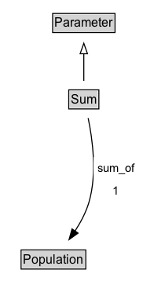

# Sum

Sum defines the sum over a variable possessed by members of the Population.

**IRI**: `https://w3id.org/citydata/21972/v1/Sum`

## Diagram

=== "SVG (interactive)"

    <!-- Generated by graphviz version 14.1.3 (20260303.0454)
     -->
    <!-- Pages: 1 -->
    <svg width="137pt" height="286pt"
     viewBox="0.00 0.00 137.00 286.00" xmlns="http://www.w3.org/2000/svg" xmlns:xlink="http://www.w3.org/1999/xlink">
    <g id="graph0" class="graph" transform="scale(1 1) rotate(0) translate(4 282)">
    <polygon fill="white" stroke="none" points="-4,4 -4,-282 132.52,-282 132.52,4 -4,4"/>
    <g id="clust3" class="cluster">
    <title>cluster_associated</title>
    </g>
    <!-- Parameter -->
    <g id="node1" class="node">
    <title>Parameter</title>
    <g id="a_node1"><a xlink:href="../Parameter" xlink:title="&lt;TABLE&gt;">
    <polygon fill="lightgray" stroke="none" points="47.25,-251.88 47.25,-268.12 104.75,-268.12 104.75,-251.88 47.25,-251.88"/>
    <text xml:space="preserve" text-anchor="start" x="48.25" y="-255.88" font-family="Arial" font-size="12.00">Parameter</text>
    <polygon fill="none" stroke="black" points="46.25,-250.88 46.25,-269.12 105.75,-269.12 105.75,-250.88 46.25,-250.88"/>
    </a>
    </g>
    </g>
    <!-- Sum -->
    <g id="node2" class="node">
    <title>Sum</title>
    <g id="a_node2"><a xlink:href="../Sum" xlink:title="&lt;TABLE&gt;">
    <polygon fill="lightgray" stroke="none" points="62.62,-178.88 62.62,-195.12 89.38,-195.12 89.38,-178.88 62.62,-178.88"/>
    <text xml:space="preserve" text-anchor="start" x="63.62" y="-182.88" font-family="Arial" font-size="12.00">Sum</text>
    <polygon fill="none" stroke="black" points="61.62,-177.88 61.62,-196.12 90.38,-196.12 90.38,-177.88 61.62,-177.88"/>
    </a>
    </g>
    </g>
    <!-- Sum&#45;&gt;Parameter -->
    <g id="edge1" class="edge">
    <title>Sum&#45;&gt;Parameter</title>
    <path fill="none" stroke="black" d="M76,-204.71C76,-212.47 76,-221.92 76,-230.74"/>
    <polygon fill="none" stroke="black" points="72.5,-230.66 76,-240.66 79.5,-230.66 72.5,-230.66"/>
    </g>
    <!-- Invis -->
    <!-- Sum&#45;&gt;Invis -->
    <!-- Population -->
    <g id="node4" class="node">
    <title>Population</title>
    <g id="a_node4"><a xlink:href="../Population" xlink:title="&lt;TABLE&gt;">
    <polygon fill="lightgray" stroke="none" points="17.12,-25.88 17.12,-42.12 76.88,-42.12 76.88,-25.88 17.12,-25.88"/>
    <text xml:space="preserve" text-anchor="start" x="18.12" y="-29.88" font-family="Arial" font-size="12.00">Population</text>
    <polygon fill="none" stroke="black" points="16.12,-24.88 16.12,-43.12 77.88,-43.12 77.88,-24.88 16.12,-24.88"/>
    </a>
    </g>
    </g>
    <!-- Sum&#45;&gt;Population -->
    <g id="edge4" class="edge">
    <title>Sum&#45;&gt;Population</title>
    <path fill="none" stroke="black" d="M80.15,-169.14C84.25,-149.49 88.86,-116.22 81,-89 78.17,-79.21 72.99,-69.48 67.5,-61.03"/>
    <polygon fill="black" stroke="black" points="70.51,-59.22 61.92,-53.02 64.77,-63.23 70.51,-59.22"/>
    <polygon fill="white" stroke="none" points="85.27,-89 85.27,-132 128.52,-132 128.52,-89 85.27,-89"/>
    <text xml:space="preserve" text-anchor="start" x="89.27" y="-117.5" font-family="Arial" font-size="11.00">sum_of</text>
    <text xml:space="preserve" text-anchor="start" x="103.9" y="-96" font-family="Arial" font-size="11.00">1</text>
    </g>
    <!-- Invis&#45;&gt;Population -->
    </g>
    </svg>

=== "PNG"

    

## Formalization for Sum

| Property | Constraint |
|----------|------------|
| [sum_of](../properties/sum_of.md) | exactly 1 |
| [sum_of](../properties/sum_of.md) | exactly 1 [Population](https://w3id.org/citydata/21972/v1/Population) |
| subClassOf | [Parameter](Parameter.md) |

