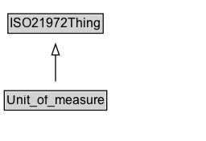

# Unit_of_measure

A unit of measure is a definite magnitude of a quantity, defined and adopted by convention and/or by law. It is used as a standard for measurement of the same quantity, where any other value of the quantity can be expressed as a simple multiple of the unit of measure. For example, length is a quantity; the metre is a unit of length that represents a definite predetermined length. When we say 10 metre (or 10 m), we actually mean 10 times the definite predetermined length called "metre".

## Diagram

=== "SVG (interactive)"

    <!-- Generated by graphviz version 14.1.3 (20260303.0454)
     -->
    <!-- Pages: 1 -->
    <svg width="192pt" height="132pt"
     viewBox="0.00 0.00 192.00 132.00" xmlns="http://www.w3.org/2000/svg" xmlns:xlink="http://www.w3.org/1999/xlink">
    <g id="graph0" class="graph" transform="scale(1 1) rotate(0) translate(4 128)">
    <polygon fill="white" stroke="none" points="-4,4 -4,-128 187.75,-128 187.75,4 -4,4"/>
    <g id="clust3" class="cluster">
    <title>cluster_associated</title>
    </g>
    <!-- ISO21972Thing -->
    <g id="node1" class="node">
    <title>ISO21972Thing</title>
    <g id="a_node1"><a xlink:href="../ISO21972Thing" xlink:title="&lt;TABLE&gt;">
    <polygon fill="lightgray" stroke="none" points="4.38,-97.88 4.38,-114.12 91.12,-114.12 91.12,-97.88 4.38,-97.88"/>
    <text xml:space="preserve" text-anchor="start" x="5.38" y="-101.88" font-family="Arial" font-size="12.00">ISO21972Thing</text>
    <polygon fill="none" stroke="black" points="3.38,-96.88 3.38,-115.12 92.12,-115.12 92.12,-96.88 3.38,-96.88"/>
    </a>
    </g>
    </g>
    <!-- Unit_of_measure -->
    <g id="node2" class="node">
    <title>Unit_of_measure</title>
    <g id="a_node2"><a xlink:href="../Unit_of_measure" xlink:title="&lt;TABLE&gt;">
    <polygon fill="lightgray" stroke="none" points="1,-25.88 1,-42.12 94.5,-42.12 94.5,-25.88 1,-25.88"/>
    <text xml:space="preserve" text-anchor="start" x="2" y="-29.88" font-family="Arial" font-size="12.00">Unit_of_measure</text>
    <polygon fill="none" stroke="black" points="0,-24.88 0,-43.12 95.5,-43.12 95.5,-24.88 0,-24.88"/>
    </a>
    </g>
    </g>
    <!-- Unit_of_measure&#45;&gt;ISO21972Thing -->
    <g id="edge1" class="edge">
    <title>Unit_of_measure&#45;&gt;ISO21972Thing</title>
    <path fill="none" stroke="black" d="M47.75,-51.79C47.75,-59.25 47.75,-68.24 47.75,-76.69"/>
    <polygon fill="none" stroke="black" points="44.25,-76.54 47.75,-86.54 51.25,-76.54 44.25,-76.54"/>
    </g>
    <!-- Invis -->
    </g>
    </svg>

=== "PNG"

    

## Specializations of Unit_of_measure

| Class | Description |
|-------|-------------|
| [Compound Unit](Compound_unit.md) |  |
| [Unit Division](Unit_division.md) |  |
| [Unit Exponentiation](Unit_exponentiation.md) |  |
| [Unit Multiple Or Submultiple](Unit_multiple_or_submultiple.md) |  |
| [Unit Multiplication](Unit_multiplication.md) |  |

## Formalization for Unit_of_measure

| Property | Constraint |
|----------|------------|
| subClassOf | [ISO21972Thing](ISO21972Thing.md) |

## Other annotations

| Property | Value |
|----------|-------|
| [om-1:alternative_label](https://w3id.org/citydata/imported/om-1/alternative_label) | unit |
| [om-1:alternative_label](https://w3id.org/citydata/imported/om-1/alternative_label) | unit of measurement |

