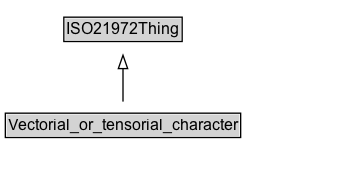

# Vectorial_or_tensorial_character

**IRI**: `https://w3id.org/citydata/21972/v1/Vectorial_or_tensorial_character`

## Diagram

=== "SVG (interactive)"

    <!-- Generated by graphviz version 14.1.3 (20260303.0454)
     -->
    <!-- Pages: 1 -->
    <svg width="272pt" height="132pt"
     viewBox="0.00 0.00 272.00 132.00" xmlns="http://www.w3.org/2000/svg" xmlns:xlink="http://www.w3.org/1999/xlink">
    <g id="graph0" class="graph" transform="scale(1 1) rotate(0) translate(4 128)">
    <polygon fill="white" stroke="none" points="-4,4 -4,-128 268.25,-128 268.25,4 -4,4"/>
    <g id="clust3" class="cluster">
    <title>cluster_associated</title>
    </g>
    <!-- ISO21972Thing -->
    <g id="node1" class="node">
    <title>ISO21972Thing</title>
    <g id="a_node1"><a xlink:href="../ISO21972Thing" xlink:title="&lt;TABLE&gt;">
    <polygon fill="lightgray" stroke="none" points="44.88,-97.88 44.88,-114.12 131.62,-114.12 131.62,-97.88 44.88,-97.88"/>
    <text xml:space="preserve" text-anchor="start" x="45.88" y="-101.88" font-family="Arial" font-size="12.00">ISO21972Thing</text>
    <polygon fill="none" stroke="black" points="43.88,-96.88 43.88,-115.12 132.62,-115.12 132.62,-96.88 43.88,-96.88"/>
    </a>
    </g>
    </g>
    <!-- Vectorial_or_tensorial_character -->
    <g id="node2" class="node">
    <title>Vectorial_or_tensorial_character</title>
    <g id="a_node2"><a xlink:href="../Vectorial_or_tensorial_character" xlink:title="&lt;TABLE&gt;">
    <polygon fill="lightgray" stroke="none" points="1,-25.88 1,-42.12 175.5,-42.12 175.5,-25.88 1,-25.88"/>
    <text xml:space="preserve" text-anchor="start" x="2" y="-29.88" font-family="Arial" font-size="12.00">Vectorial_or_tensorial_character</text>
    <polygon fill="none" stroke="black" points="0,-24.88 0,-43.12 176.5,-43.12 176.5,-24.88 0,-24.88"/>
    </a>
    </g>
    </g>
    <!-- Vectorial_or_tensorial_character&#45;&gt;ISO21972Thing -->
    <g id="edge1" class="edge">
    <title>Vectorial_or_tensorial_character&#45;&gt;ISO21972Thing</title>
    <path fill="none" stroke="black" d="M88.25,-51.79C88.25,-59.25 88.25,-68.24 88.25,-76.69"/>
    <polygon fill="none" stroke="black" points="84.75,-76.54 88.25,-86.54 91.75,-76.54 84.75,-76.54"/>
    </g>
    <!-- Invis -->
    </g>
    </svg>

=== "PNG"

    

## Formalization for Vectorial_or_tensorial_character

| Property | Constraint |
|----------|------------|
| subClassOf | [ISO21972Thing](ISO21972Thing.md) |

