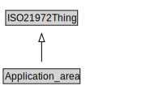

# Application_area

<a href="../../diagrams/i72__Application_area.dot.svg">Open interactive Application_area diagram</a>

## Formalization for Application_area

| Property | Constraint |
|----------|------------|
| subClassOf | ISO21972Thing |

