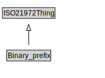

# Binary_prefix

<a href="../../diagrams/i72__Binary_prefix.dot.svg">Open interactive Binary_prefix diagram</a>

## Formalization for Binary_prefix

| Property | Constraint |
|----------|------------|
| subClassOf | ISO21972Thing |

