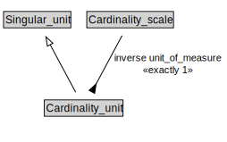

# Cardinality_unit

<a href="../../diagrams/i72__Cardinality_unit.dot.svg">Open interactive Cardinality_unit diagram</a>

## Formalization for Cardinality_unit

| Property | Constraint |
|----------|------------|
| inverse unit_of_measure | exactly 1 owl::Thing |
| subClassOf | Singular_unit |

