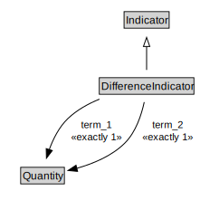

# DifferenceIndicator

<a href="../../diagrams/i72__DifferenceIndicator.dot.svg">Open interactive DifferenceIndicator diagram</a>

## Formalization for DifferenceIndicator

| Property | Constraint |
|----------|------------|
| subClassOf | Indicator |
| term_1 | exactly 1 owl::Thing |
| term_2 | exactly 1 owl::Thing |

