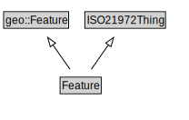

# Feature

<a href="../../diagrams/i72__Feature.dot.svg">Open interactive Feature diagram</a>

## Formalization for Feature

| Property | Constraint |
|----------|------------|
| subClassOf | geo::Feature |
| subClassOf | ISO21972Thing |

