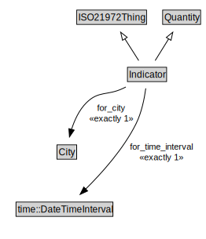

# Indicator

<a href="../../diagrams/i72__Indicator.dot.svg">Open interactive Indicator diagram</a>

## Specializations of Indicator

| Class | Description |
|-------|-------------|
| [Difference Indicator (i72)](i72__DifferenceIndicator.md) |  |
| [Ratio Indicator (i72)](i72__RatioIndicator.md) |  |
| [Sum Indicator (i72)](i72__SumIndicator.md) |  |

## Formalization for Indicator

| Property | Constraint |
|----------|------------|
| for_city | exactly 1 owl::Thing |
| for_time_interval | exactly 1 owl::Thing |
| subClassOf | ISO21972Thing |
| subClassOf | Quantity |

