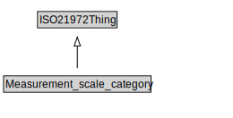

# Measurement_scale_category

<a href="../../diagrams/i72__Measurement_scale_category.dot.svg">Open interactive Measurement_scale_category diagram</a>

## Formalization for Measurement_scale_category

| Property | Constraint |
|----------|------------|
| subClassOf | ISO21972Thing |

## Used by classes

| Class | Property |
|-------|----------|
| [nominal scale](i72__nominal scale.md) | element |

