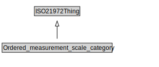

# Ordered_measurement_scale_category

<a href="../../diagrams/i72__Ordered_measurement_scale_category.dot.svg">Open interactive Ordered_measurement_scale_category diagram</a>

## Formalization for Ordered_measurement_scale_category

| Property | Constraint |
|----------|------------|
| subClassOf | ISO21972Thing |

## Used by classes

| Class | Property |
|-------|----------|
| [ordinal scale](i72__ordinal scale.md) | element |

