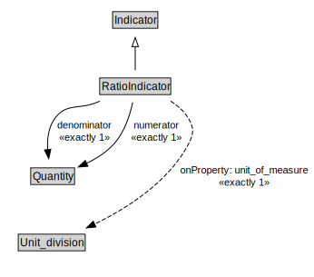

# RatioIndicator

<a href="../../diagrams/i72__RatioIndicator.dot.svg">Open interactive RatioIndicator diagram</a>

## Formalization for RatioIndicator

| Property | Constraint |
|----------|------------|
| denominator | exactly 1 owl::Thing |
| numerator | exactly 1 owl::Thing |
| subClassOf | Indicator |
| unit_of_measure | exactly 1 owl::Thing |

