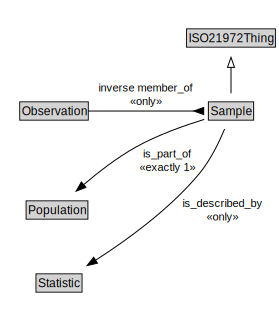

# Sample

<a href="../../diagrams/i72__Sample.dot.svg">Open interactive Sample diagram</a>

## Formalization for Sample

| Property | Constraint |
|----------|------------|
| inverse member_of | all Observation |
| is_described_by | all Statistic |
| is_part_of | exactly 1 owl::Thing |
| subClassOf | ISO21972Thing |

